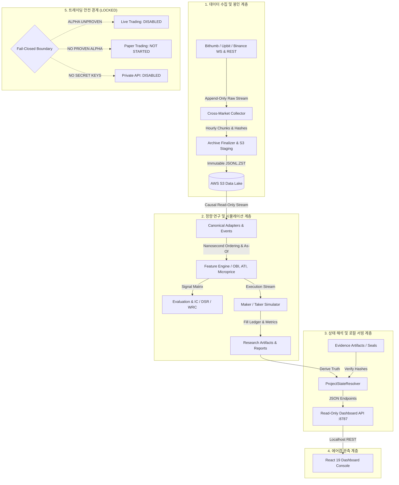

# 시스템 아키텍처 및 설계 원칙 (System Architecture & Principles)

- **최종 갱신 일시**: 2026-09-17T01:00:00Z
- **핵심 원칙**: 엄격한 단방향 의존성, 격리성, Fail-Closed, 원시 증거 기반 단일 진실 공급원 (Single Source of Truth)

---

## 1. 계층형 아키텍처 다이어그램

---

## 2. 주요 서브시스템 구성

### 1) 연구 인프라 (`src/bithumb_coin_trader/research_infra/`)
- **`canonical_events.py`**: 표준 캐노니컬 이벤트 정의.
  - `ordering_timestamp_ns`: 단일 시계열 정렬 기준.
  - `exchange_timestamp_ms`: 거래소 발생 시각 (결측 시 None, `NONE_AVAILABLE`).
  - `availability_timestamp_ns`: 로컬 수신/가용 시각.
  - `causal_availability_ns`: 인과적 정보 가용 시점 (`ordering_ts`와 `availability_ts` 중 최대값). 미래 정보 누출 방지 보장.
- **`adapters.py`**: 빗썸, 업비트, 바이낸스 원시 피드(호가, 체결, 티커)를 캐노니컬 이벤트로 무손실 정규화.
- **`maker_simulator.py`**:
  - 패시브 대기열 시뮬레이터.
  - BUY/SELL 완벽 대칭 지원.
  - 대기열 소진 모델: Optimistic, Base, Conservative (대기열 앞선 물량 가정 배수 q=0.5, q=1.0 지원).
  - 부분 체결(Partial fill) 발생 시 잔여 미체결 수량에 대한 안전한 테이커 강제 청산 및 포지션 회계 지원.
  - 지연시간(Latency) 및 취소 한도(Cancel Horizon) 스트레스 테스트 지원.
- **`research_infra/evaluation.py`**:
  - `compute_spearman_rank_ic`: 동점(Ties) 발생 시 평균 순위(`rankdata_average`)를 적용하여 왜곡 없는 순위 상관계수 산출.
  - `compute_directional_diagnostics`: 0이 아닌 실제 가격 변동 표본에 대한 방향 적중률(`nonzero_directional_hit_rate`) 및 0값 비중(`zero_fraction`) 분리 진단.

### 2) 상태 해석 및 대시보드 API (`src/bithumb_coin_trader/`)
- **`project_state.py`**:
  - 단일 진실 공급원(Single Source of Truth). 하드코딩 없이 파일시스템 증거(`evidence/`, `research-artifacts/`)로부터 실시간 상태 도출.
- **`dashboard_api.py`**:
  - 포트 8787 경량 읽기 전용 HTTP 서버. 외부 통신 없는 안전한 로컬 API.

### 3) 프론트엔드 대시보드 (`dashboard/`)
- React 19 + TypeScript + Vite 기반 SPA.
- 외부 API 호출(fetch, axios, WebSocket 등)이 전혀 없는 완전 격리형(Air-gapped) 오프라인 증거 뷰어.

---

## 3. 안전 및 Fail-Closed 설계 규약

1. **상태 분리**:
   - 연구 코드와 실거래 코드는 분리되어 있으며, 실거래 주문 전송 경로는 `Fail-Closed`로 영구 차단되어 있습니다.
2. **비밀값 관리**:
   - 개인 API Key, Secret 등은 Git 추적 파일에 일절 포함되지 않으며, 테스트 환경에서도 가상/모의 데이터만 사용합니다.
3. **읽기 전용 AWS 접근**:
   - AWS 자원에 대한 접근은 읽기 전용 권한(`s3:GetObject`, `s3:ListBucket`)으로 엄격히 제한됩니다.
