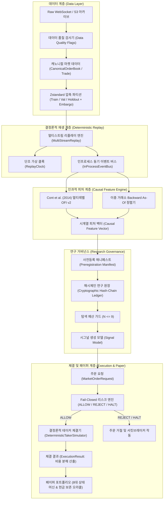

# 연구에서 실행까지의 종단간 시스템 아키텍처 (Research to Execution Architecture)

## 1. 개요
본 아키텍처는 고빈도 마이크로스트럭처(Order Book, Trade Ticks) 데이터를 기반으로 인과적 특성 추출, 거버넌스 검증 연구, 사전 리스크 통제, 정밀 체결 시뮬레이션 및 페이퍼 트레이딩을 수행하는 통합 플랫폼의 구조를 정의한다.

## 2. 종단간 파이프라인 흐름도 (End-to-End Data Pipeline)

## 3. 계층별 핵심 설계 원칙

### 3.1. 데이터 및 스토리지 계층
- **거래소 중립성**: Bithumb, Binance, Upbit의 비동기 피드를 표준 `CanonicalOrderBook`, `CanonicalTrade`, `CanonicalTicker`로 일원화.
- **엄격한 유효성 검증**: 비유한수(NaN, Inf), 음수 가격/수량, 역전 호가(Crossed book)를 스토리지 적재 단계에서 차단.
- **엠바고 파티셔닝**: Train, Validation, Holdout 분할 경계 사이에 15분(900초) 이상의 정화 기간(Purge window)을 강제하여 시계열 자기상관 누출(Autocorrelation Bleed) 원천 차단.

### 3.2. 결정론적 재생 계층
- **벽시계 격리**: `time.time()`, `time.sleep()` 등의 시스템 벽시계 호출을 완전히 배제하고 오직 이벤트 수신 타임스탬프(`receive_timestamp_ms`)로만 가상 클록(`ReplayClock`)을 전진.
- **단조성 보장**: 이전 시점으로의 클록 역행 시 `ClockViolationError`를 발생시켜 시간 왜곡 방지.

### 3.3. 인과적 피처 계층
- **제1원리 호가 불균형**: Cont, Kukanov & Stoikov (2014) 수학적 정의에 따라 가격 레벨 변동 시 호가 잔량 유입/유출을 엄밀히 분해한 Level-1~5 OFI 계산.
- **엄격한 Backward As-Of 조인**: 타 거래소(Binance) 데이터를 기준 거래소(Bithumb) 시점에 정렬할 때 $t_{binance} \le t_{bithumb} - \delta_{latency}$를 만족하는 직전 시점의 레코드만 인과적으로 결합.

### 3.4. 연구 거버넌스 계층
- **사전등록 의무화**: 가설, 피처셋, 예측 지평, 최대 시도 횟수가 명시된 매니페스트 없이 백테스트 실행 불가.
- **변조 불가 해시체인 원장**: 모든 시도(Trial)는 직전 엔트리의 SHA-256 해시를 포함하여 블록체인 형태로 영구 봉인.
- **시도 횟수 상한 강제**: 가설 패밀리당 $N \le 9$ 초과 시도시 `TrialBudgetExceededError` 발생.

### 3.5. 체결 및 페이퍼 포트폴리오 계층
- **Fail-Closed 사전 리스크**: 입력값 결측, 시장 데이터 노후화, 과도한 스프레드, 서킷브레이커 발동 시 즉시 `REJECT` 또는 `HALT`.
- **현금 보존 오라클**: Python Decimal 정밀도를 기반으로 모든 체결 전후의 자산 보존식을 1원/1사토시 단위로 교차 검증.
- **무차입/현물 전용**: 잔고가 0 미만으로 떨어지는 거래를 원천 차단(`NegativeBalanceError`).
