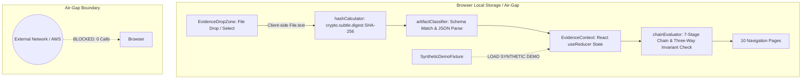

# DASHBOARD v0.2 OFFLINE EVIDENCE & RESEARCH CONSOLE — CODEX HANDOFF

## 1. Baseline & Branch Metadata
- **BASE_MAIN_SHA**: `4b46c9ed47afb67dd74e742ce1acf455508b2f6e` (Phase 6.2 merged to main)
- **FEATURE_BRANCH**: `gemini/dashboard-v0-2-evidence-console-20260907`
- **TARGET ENVIRONMENT**: Browser Local Offline Memory Only (Air-Gap)
- **AWS / LIVE SOAK INTERACTION**: ZERO (0 AWS calls, 0 soak interference, live trading locked)
- **MAIN MERGE STATUS**: NOT PERFORMED (Role separation: Gemini feature branch push only)

---

## 2. Changed & Created Files

### A. Core Architecture & Evidence Engine
- `dashboard/src/types.ts`: 대시보드 v0.2 통합 도메인 타입 (아티팩트 11종, 모드 3종, 증거 라벨, 체인 노드 상태 등)
- `dashboard/src/evidence/artifactClassifier.ts`: 11종 아티팩트 자동 분류기 및 JSON 파서
- `dashboard/src/evidence/hashCalculator.ts`: Web Crypto API 기반 로컬 SHA-256 계산기 (결정론적 TS 폴백 포함)
- `dashboard/src/evidence/chainEvaluator.ts`: 7단계 권위적 증거 사슬 검증기 및 삼자 불변식(Three-Way Invariants) 평가기

### B. State Management & Context
- `dashboard/src/context/evidenceContextDef.ts`: 상태 모델, 리듀서, Context 인터페이스
- `dashboard/src/context/useEvidence.ts`: 안전한 Context 접근 훅 (Fast Refresh / oxlint 규약 준수)
- `dashboard/src/context/EvidenceContext.tsx`: React Context Provider

### C. Fixtures & Design System
- `dashboard/src/fixtures/syntheticDemoData.ts`: 76개 피드 유니버스 및 73개 코호트 등 모의 합성 픽스처
- `dashboard/src/index.css`: 고밀도 정량 연구 워크스테이션 다크 테마 디자인 시스템

### D. Reusable UI Components
- `dashboard/src/components/EvidenceDropZone.tsx`: 로컬 다중 JSON 드래그앤드롭 및 Web Crypto SHA 계산기 (서버 업로드 0건)
- `dashboard/src/components/ModeBanner.tsx`: 3대 모드 배너 (`NO EVIDENCE`, `SYNTHETIC DEMO`, `IMPORTED EVIDENCE`)
- `dashboard/src/components/PipelineStrip.tsx`: 11단계 프로젝트 라이프사이클 스트립
- `dashboard/src/components/EvidenceChainDiagram.tsx`: 7단계 증거 사슬 시각화 다이어그램
- `dashboard/src/components/EvidenceArtifactCard.tsx`: 개별 아티팩트 메타데이터 카드
- `dashboard/src/components/ScopeBadge.tsx`: 감사 범위 배지 (`FULL`, `SAMPLED`, `MANIFEST-DERIVED`, `NOT AVAILABLE`)
- `dashboard/src/components/StatusBadge.tsx`: 상태 배지
- `dashboard/src/components/MetricCard.tsx`: 수치 및 출처 증거 배지 카드

### E. Pages (10대 내비게이션)
- `dashboard/src/pages/Overview.tsx`: 글로벌 8대 상태 매트릭스, 라이프사이클 스트립, 빠른 진단
- `dashboard/src/pages/Soak72h.tsx`: 72H 수집 완료 판정 vs DQ 판정 분리, 76개 피드 유니버스, 슬롯
- `dashboard/src/pages/EvidenceChain.tsx`: 7단계 사슬 플로우, 삼자 불변식, 아티팩트 관리 그리드
- `dashboard/src/pages/DataQuality.tsx`: 최종 판정, 하드 블로커, 품질저하, 전수 스트리밍 무결성 지표
- `dashboard/src/pages/Dataset.tsx`: 72시간 시계열 표본 분할(Holdout SEALED) 및 10종 출처 메타데이터
- `dashboard/src/pages/ResearchLab.tsx`: 사전등록 마이크로스트럭처(OFI/ATI/MPQI), DSR/WRC/PBO 거버넌스, 베이스라인 및 거절 원장
- `dashboard/src/pages/SafetyCenter.tsx`: 7대 불변 안전 게이트 (언락 스위치 없음)
- `dashboard/src/pages/Events.tsx`: 파생 이벤트 타임라인 (`UI DERIVED` 명시)
- `dashboard/src/pages/Infrastructure.tsx`: 정적 5단계 토폴로지 다이어그램 (`SEALED CONFIGURATION`)
- `dashboard/src/pages/Trading.tsx`: 실행 계층 완전 잠금 및 5대 선행 필수 조건

### F. Tests & Configuration
- `dashboard/src/App.test.tsx`: P21 12대 요구사항 전수 검증 Vitest 스위트
- `dashboard/tsconfig.app.json`: Node 타입 및 브라우저 클라이언트 설정 동기화
- `dashboard/README.md`: v0.2 아키텍처, 실행 가이드, 안전 경계 문서화
- **레거시 삭제**: `mockData.ts`, `CollectorHealth.tsx`, `LogsEvents.tsx`, `PlaceholderPage.tsx`

---

## 3. Architecture Summary

---

## 4. Hash Validation & Artifact Parsers
1. **로컬 해시 계산**:
   - `crypto.subtle.digest('SHA-256', buffer)`를 우선 사용하며, 순수 소프트웨어 SHA-256 결정론적 알고리즘을 폴백으로 내장.
   - 대용량 파일 가드: 10MB 초과 파일에 대해 즉시 경고하고 수십 GiB RAW 파일의 브라우저 로드를 원천 차단.
2. **지원 아티팩트 파서 (11종)**:
   - `runtime_seal`: 런타임 소프트웨어 커밋, 핑거프린트, 피드 설정
   - `launch_provenance`: 수집기 런칭 커밋, 런 ID, 에포크
   - `actual_start_evidence`: 실제 systemd/소켓 개시 시각 증거 (Phase 6.2 스펙 준수)
   - `epoch_contract`: 72H 무인 수집 불변 계약 (76개 피드 정의)
   - `epoch_manifest`: 원시 파티션 루트 매니페스트 (셀프 해시 및 계약 해시)
   - `deep_dq_report`: 72H 전수 심층 데이터 품질 감사 결과
   - `dq_qualification`: 심층 DQ 판정 승인서
   - `canonical_manifest`: 캐노니컬 정렬 파티션 루트 매니페스트
   - `dataset_manifest`: 72시간 3구간(Discovery 24h / Validation 24h / Holdout 22h) 표본 분할 매니페스트
   - `archive_receipt`: 시간별 S3 아카이브 영수증
   - `fullscan_report`: 무결성 전수 조사 보고서

---

## 5. Verification & Test Results
- **TypeScript 정적 분석 (`npm run typecheck`)**: 0 errors
- **린터 검증 (`npm run lint` - oxlint)**: 0 warnings, 0 errors (31 files, 116 rules)
- **단위/통합 테스트 (`npm test` - Vitest 12 suites)**: 12 passed (100%)
  1. Default mode = `NO EVIDENCE` (0 loaded artifacts, explicit unverified state)
  2. Load demo = `SYNTHETIC DATA` persistent watermark / badge & clean clear
  3. Unknown artifact gracefully classified as `UNKNOWN_TYPE`
  4. Malformed JSON caught as `PARSE_FAILED` with validation error
  5. SHA-256 deterministic computation for empty and text payloads
  6. Incomplete evidence chain detected as `INCOMPLETE`; missing actual start flagged `INVALID` (Fail-Closed)
  7. Hash mismatch detected and flagged on chain nodes
  8. DQ FAIL never displays green verified or PASS
  9. Missing metric values never converted to fake `0` or `0.0%` (Epistemic Rule)
  10. Holdout partition visibly `SEALED` with 0 unlock/reveal buttons
  11. Trading page completely locked (`DISABLED`) with 0 BUY/SELL/order controls
  12. Air-gap isolation test: Zero `fetch`, `axios`, `WebSocket`, `EventSource`, or `XMLHttpRequest` in source
- **프로덕션 빌드 (`npm run build`)**: Success (Vite bundle built in ~280ms)

---

## 6. Security & Air-Gap Audit
- **AWS API / CLI 호출**: 0건
- **외부 네트워크 클라이언트**: 0건
- **개인 식별 절대 경로 노출**: 0건
- **위험 명령어 / 임의 실행**: 없음
- **HTML Injection Guard**: `dangerouslySetInnerHTML` 일체 미사용

---

## 7. DO NOT TRUST WITHOUT CODEX REVIEW

다음 영역은 프론트엔드 UI/UX 수준에서 계약을 충실히 모델링하였으나, **반드시 Codex의 독립적인 백엔드/암호학적 감사 및 검증을 거친 후 승인되어야 합니다**:

1. **Cryptographic / Hash-Chain Semantics**:
   - 프론트엔드에서 계산된 `crypto.subtle.digest`가 Python의 `hashlib.sha256` 및 Canonical JSON 직렬화와 완벽히 동일한 바이트 표현을 처리하는지 검증.
2. **Python ↔ TypeScript Schema Parity**:
   - `dashboard/src/types.ts`의 속성명이 실제 `src/collector/soak_contract.py`, `audit_report.py`, `qualification.py`, `canonical_pipeline.py`의 Pydantic / Dataclass 필드와 완벽히 1:1 일치하는지 대조.
3. **Artifact Qualification Rules**:
   - 심층 DQ 감사 통과 조건(하드 블로커 0건, 타임스탬프 역전 0건 등)의 게이트 평가 로직이 `scripts/audit_72h_soak_deep.py`와 정합성을 갖추는지 확인.
4. **Self-Hash Canonicalization**:
   - `epoch_manifest.json` 및 `epoch_contract.json`의 셀프 해시 계산 시 자기 자신 필드 제외 규칙의 일치 여부.
5. **Source Provenance Relationships**:
   - 런칭 출처, 런타임 씰, 실제 시작 증거 간의 상호 참조 관계가 실제 Phase 6.2 계약과 일치하는지 확인.
6. **Evidence-Chain Global Verdict**:
   - 7단계 노드 상태 종합 평가 시 `MISMATCH`, `INVALID`, `INCOMPLETE`, `COMPLETE` 전이 조건의 안전성(Fail-Closed).
7. **File-Size / Malformed-Input Hardening**:
   - 비정상 크기나 왜곡된 키 구조를 가진 JSON 입력 시 메모리 누수나 크래시를 완벽히 방어하는지 추가 스트레스 테스트 필요.
