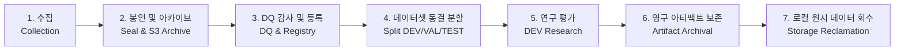

# 데이터 생명주기 및 거버넌스 정책 (Data Lifecycle & Governance)

- **최종 갱신 일시**: 2026-09-17T01:00:00Z
- **적용 대상**: 마이크로스트럭처 원시 데이터, 파생 피처, 증거 아티팩트, 로컬 캐시

---

## 1. 데이터 생명주기 단계 (Lifecycle Stages)

### 단계별 상세 규정
1. **수집 (Collection)**:
   - 빗썸, 바이낸스, 업비트 웹소켓/REST 피드를 시간 단위 코호트(`YYYY-MM-DD_HH`)로 분할하여 Append-Only 저장.
2. **봉인 및 아카이브 (Seal & S3 Archive)**:
   - 매 시간 마감 시 SHA-256 체크섬을 계산하고 Zstandard(`jsonl.zst`) 압축 후 S3에 업로드.
3. **DQ 감사 및 등록 (DQ & Registry)**:
   - 타임스탬프 비역전성, 슬롯 누락, 스키마 유효성을 전수 감사하고 `dataset_registry.json`에 공식 등록.
4. **데이터셋 동결 분할 (Split DEV/VAL/TEST)**:
   - 수익률 확인 전 시간순 블록 분할 (예: 18h DEV, 6h VAL, 6h TEST).
   - 검증(VAL) 및 테스트(TEST) 구간은 개발 단계에서 절대 열람/사용 금지.
5. **연구 평가 (DEV Research)**:
   - 오직 DEV 구간만 사용하여 피처 예측력(IC) 및 체결 시뮬레이션(Maker/Taker) 수행.
6. **영구 아티팩트 보존 (Artifact Archival)**:
   - 연구 결과 보고서, 시험 원장(`TRIAL_LEDGER.jsonl`), 감사 기록은 Git에 영구 추적.
7. **로컬 원시 데이터 회수 (Storage Reclamation)**:
   - 재현 가능한 수십 GB의 로컬 원시 파일은 연구 완료 후 삭제하여 디스크 고갈 방지 (`DELETE_AFTER_RESEARCH`).

---

## 2. 데이터 분할 규약 (Dataset Splitting Protocol)

V2 권위적 데이터셋(`aws-validation-30h-20260912-6576f63`)의 공식 분할 기준:

| 분할 영역 | 시간 범위 (UTC) | 시간 수 | 사용 목적 및 권한 |
| :--- | :---: | :---: | :--- |
| **DEV (개발)** | 2026-09-12 11:00 ~ 2026-09-13 04:00 | 18시간 | 가설 탐색, 피처 엔지니어링, 메이커/테이커 체결 시뮬레이션 |
| **VAL (검증)** | 2026-09-13 05:00 ~ 2026-09-13 10:00 | 6시간 | 후보 모델 하이퍼파라미터 검증 (현재 미진입: DEV 통과 후보 부재) |
| **TEST (홀드아웃)** | 2026-09-13 11:00 ~ 2026-09-13 16:00 | 6시간 | 최종 단 1회 성과 측정 (암호학적 봉인 유지, 미개봉) |

---

## 3. 저장공간 회수 및 안전성 (Storage Safety)

- **보존 원칙**:
  - `evidence/` (검증 증거, JSON 씰): 영구 보존 (`KEEP_SMALL_EVIDENCE`)
  - `research-artifacts/` (시험 원장, 최종 보고서): 영구 보존 (`KEEP_SMALL_EVIDENCE`)
  - `test-results/`: **STRICTLY PROTECTED** (절대 수정/삭제/스테이징 금지)
- **회수 성과**:
  - 레거시 74 GB 대용량 원시 데이터 파티션 안전 삭제 완료.
  - 전체 저장공간 98.4% 회수, 현재 레포지토리 약 890 MB 수준으로 최적화 완료.
