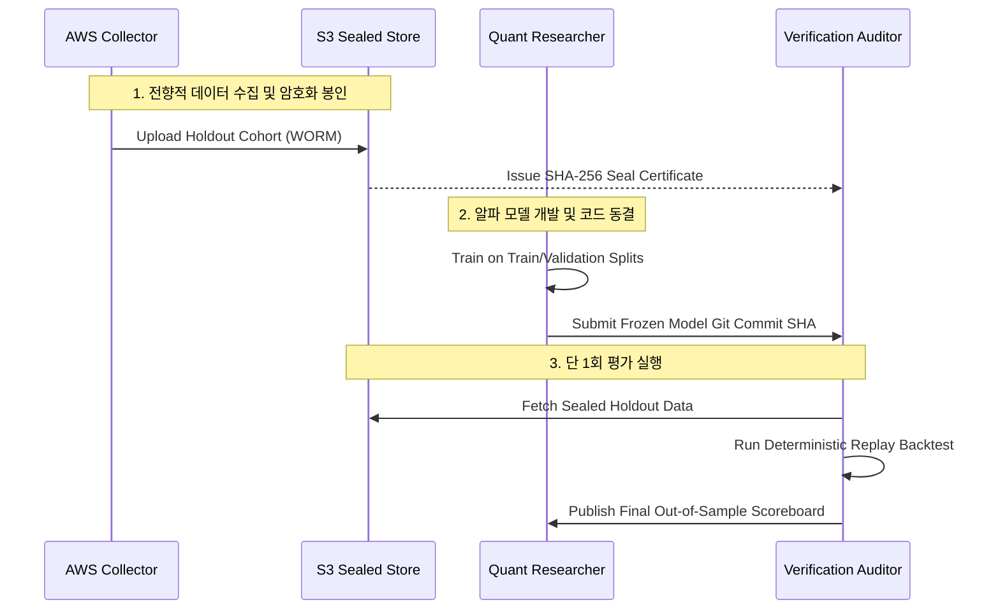

# 미래 전향적 마이크로스트럭처 홀드아웃 프로토콜 (Future Prospective Microstructure Holdout Protocol)

> [!CAUTION]
> **과거 캔들 홀드아웃의 한계와 마이크로스트럭처 오염 방지:**
> 과거 일봉/분봉 기반 캔들 홀드아웃은 호가창 불균형(OFI), 틱 단위 체결 비대칭, 큐 대기 시간 등의 마이크로스트럭처 특성을 전혀 검증할 수 없다. 또한 이미 연구자에게 노출된 과거 데이터를 재사용할 경우 과적합(Overfitting)과 데이터 누수(Data Leakage)가 필연적으로 발생한다. 따라서 마이크로스트럭처 알파 검증은 오직 **전향적으로 수집된 봉인 홀드아웃(Prospective Sealed Holdout)**만을 사용해야 한다.

---

## 1. 전향적 홀드아웃 5대 원칙

1. **전향적 수집 (Prospective Collection Only):**
   - 전략 아이디어와 가설이 수립된 시점 *이후*에 실시간 수집된 데이터만을 홀드아웃으로 배정한다.
2. **사전 엿보기 절대 금지 (Strict No Peeking):**
   - 홀드아웃 기간 동안 원시 데이터에 대한 기초 통계량(수익률, 변동성, 체결량) 조회 및 시각화를 금지한다.
3. **평가 전 전략 코드 및 파라미터 완전 동결 (Pre-Evaluation Code Freeze):**
   - 특성 추출기, 모델 가중치, 진입/청산 임계치, 슬리피지 모델의 Git 커밋 SHA를 암호학적으로 봉인(Seal)한 후에만 홀드아웃에 접근할 수 있다.
4. **단 1회 최종 평가 원칙 (Single Final Evaluation):**
   - 홀드아웃 데이터셋에 대한 백테스트는 단 1회만 허용된다.
   - 홀드아웃 평가 결과를 본 후 파라미터를 미세 조정하여 재실행하는 행위는 통계적 사기로 간주한다.
5. **완전한 감사 추적 (Audit Trail):**
   - 데이터 수집부터 봉인 해제, 평가 실행, 결과 보고서 작성까지 모든 과정이 시간순으로 감사 로그에 불변 기록되어야 한다.

---

## 2. 홀드아웃 봉인 및 해제 워크플로우

---

## 3. 봉인 명세 및 메타데이터 형식

홀드아웃 데이터셋은 개봉 전 아래의 메타데이터가 사전 등록되어야 한다:
- `holdout_dataset_id`: 고유 식별자 (예: `microstructure-holdout-2026Q4-v1`)
- `collection_start_utc`: 수집 시작 시각
- `collection_end_utc`: 수집 종료 시각
- `sealed_archive_sha256`: 전체 아카이브 아티팩트의 해시
- `target_markets`: 대상 마켓 유니버스
- `strategy_commit_sha`: 사전 등록된 동결 전략 커밋
