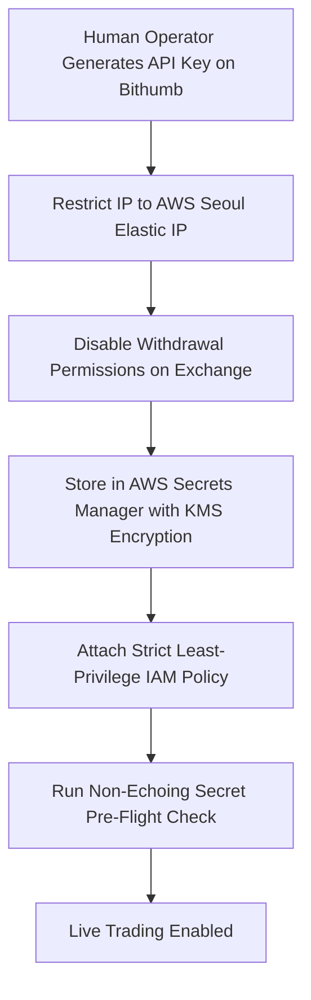

# Live Secret Gate & Key Management Runbook

**Document Version:** 1.0.0  
**Effective Date:** 2026-09-05  
**Classification:** STRICT FAIL-CLOSED SECURITY SPECIFICATION  
**Scope:** Bithumb API credentials and AWS Secrets Manager integration for future automated trading.

---

## 1. Zero-Secret Guarantee During Soak Phase

> [!CAUTION]
> **ABSOLUTELY NO TRADING SECRETS ARE PROVISIONED DURING THE 72-HOUR SOAK.**  
> The 72H soak operates exclusively on public unauthenticated WebSocket and REST market data feeds.  
> No private API keys, withdrawal permissions, or trading secrets exist in environment variables, EC2 instance metadata, SSM parameters, Terraform state, or Git history.

---

## 2. Post-72H Secret Lifecycle Protocol

Any future transition to live order routing requires completing the following lifecycle phases in order:



### 2.1 Exchange-Side Hardening
1. **IP Whitelisting:** Bithumb API keys must be strictly bound to the static Elastic IP (EIP) of the production trading instance.
2. **Withdrawal Disable:** Withdrawal and transfer permissions must remain permanently **DISABLED** at the exchange account level. Only `trade` and `query` permissions are permitted.

### 2.2 AWS Secrets Manager & KMS Architecture
1. **Secret Storage Path:** `arn:aws:secretsmanager:ap-northeast-2:<account-id>:secret:bithumb/trader/api_credentials`
2. **Dedicated KMS Customer Managed Key (CMK):** Keys must be encrypted using a dedicated CMK with explicit key policy.
3. **IAM Boundary:**
   - Only the designated EC2 instance role (`bitcoin-trader-execution-role`) may invoke `secretsmanager:GetSecretValue` and `kms:Decrypt`.
   - Wildcards (`"Resource": "*"`) are strictly prohibited.
   - Root and administrative roles must not have default access to trading secrets without explicit break-glass logging.

---

## 3. Pre-Flight Secret Validation Protocol (Non-Echoing)

When secret retrieval is enabled, verification must follow a **Fail-Closed Zero-Exposure** pattern:

1. **Existence Verification:** Check secret metadata via `DescribeSecret` without fetching `SecretString`.
2. **Key Length & Format Check:** Confirm secret contains non-empty `connect_key` and `secret_key` matching Bithumb hexadecimal format.
3. **Log Sanitization:**
   - Secrets must NEVER be printed to stdout/stderr.
   - Logs may only report boolean status: `BITHUMB_SECRET_LOADED: PASS` or `BITHUMB_SECRET_LOADED: FAIL`.
   - Logging frameworks must enforce regex masking on token-like strings.

---

## 4. Emergency Kill-Switch & Revocation Runbook

If anomalous order behavior, latency spike, or security compromise occurs:

### Step 1: Immediate Exchange Key Revocation (Primary Kill-Switch)
1. Log into Bithumb Web Console immediately.
2. Delete the active API key pair. This instantly invalidates all signature generation.

### Step 2: AWS Secret Blacklisting
Execute immediate deletion of the secret in AWS Secrets Manager:
```bash
aws secretsmanager delete-secret \
  --secret-id bithumb/trader/api_credentials \
  --force-delete-without-recovery \
  --region ap-northeast-2
```

### Step 3: EC2 Execution Role IAM Detachment
Detach the secret retrieval policy from the instance profile to permanently prevent memory reloading:
```bash
aws iam detach-role-policy \
  --role-name bitcoin-trader-execution-role \
  --policy-arn arn:aws:iam::<account-id>:policy/bitcoin-trader-secret-access
```

---

## 5. Pre-Provisioning Audit Checklist

Before any live trading secret is created or stored:
- [ ] 72-Hour Soak completed with zero data corruption and full reconciliation.
- [ ] Post-soak data quality audit passed (no missing hours, no unhandled feed drops).
- [ ] Strategy candidate has passed preregistered validation and holdout hurdle.
- [ ] Taker execution simulator confirms net positive expectancy under 250ms latency.
- [ ] Emergency kill-switch runbook rehearsed and confirmed functional.
- [ ] Explicit written user sign-off obtained.
