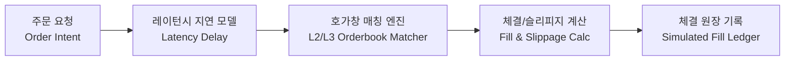

# 오프라인 테이커 주문 체결 시뮬레이터 사양서 (Offline Taker Execution Simulator Specification)

> [!NOTE]
> 본 사양서는 수집된 마이크로스트럭처 호가/체결 데이터를 기반으로 현실적인 주문 집행 비용(슬리피지, 큐 대기, 수수료)을 정밀 시뮬레이션하기 위한 오프라인 전용 아키텍처 명세서이다. 거래 전략이나 사설(Private) API는 포함하지 않는다.

---

## 1. 시뮬레이터 핵심 컴포넌트

---

## 2. 세부 모델링 규칙

### 2.1 인위적 레이턴시 지연 (Latency Injection)
- 전략이 신호 $S(t)$를 발생시킨 후, 주문이 거래소 매칭 엔진에 도달하기까지의 물리적 지연시간 $\Delta \tau$를 반드시 시뮬레이션한다:
  $$t_{\text{match}} = t_{\text{signal}} + \Delta \tau_{\text{network}} + \Delta \tau_{\text{exchange\_queue}}$$
- 기본 파라미터:
  - $\Delta \tau_{\text{network}} \sim \text{LogNormal}(\mu=15\text{ms}, \sigma=5\text{ms})$
  - 꼬리 위험(Tail latency p99): $100\text{ms}$

### 2.2 호가창 깊이 기반 슬리피지 (Depth-Weighted Slippage)
- 테이커 주문 수량 $Q_{\text{order}}$가 상위 1호가 잔량 $q_1$을 초과할 경우, 차상위 호가창을 잠식(Walk the book)하며 체결 가중 평균 가격(VWAP)을 산출한다:
  $$P_{\text{fill}} = \frac{\sum_{k=1}^m q_k \cdot p_k}{Q_{\text{order}}}, \quad \sum_{k=1}^m q_k = Q_{\text{order}}$$

### 2.3 부분 체결 (Partial Fills)
- 가용한 유동성이 주문 총량보다 작을 경우 미체결 잔량은 즉시 취소(IOC, Immediate-Or-Cancel) 또는 대기 정책을 설정할 수 있다.

### 2.4 거래소 수수료 모델 (Fee Model)
- Bithumb: 테이커 수수료 0.04% (쿠폰 적용 시 변동 가능)
- Upbit: 테이커 수수료 0.05%
- Binance USDT-M: 테이커 수수료 0.04% / 0.02% (VIP 등급별)

### 2.5 오래된 호가창 폐기 정책 (Stale-Book Policy)
- 직전 호가창 스냅샷과 현재 주문 시점 사이의 간격이 5초 이상 벌어진 경우(`stale_book = true`), 해당 주문은 무효 처리(Reject)되어 체결이 거부된다.
