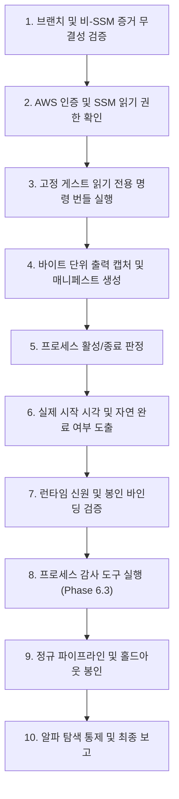

# Astra 전용 Post-72H 소크 감사 재개 실행 체크리스트 (2026-09-08)

## 1. 문서 목적 및 역할 정의 (Mission & Role)

본 문서는 SSM 읽기 전용 권한이 복구된 후, **Astra(또는 수석 과학 감사관)**가 72시간 소크 수집 프로세스의 최종 생사 여부, 자연 완료 여부, 데이터 무결성(DQ), 적격성 판정(Qualification), 정규 데이터셋 생성 및 봉인 절차를 무결하게 수행할 수 있도록 정의된 **권위적 실행 절차서(Authoritative Resume Runbook)**이다.

> [!IMPORTANT]
> **과학적 상태 불변 원칙 (Fail-Closed Scientific Invariant):**
> 본 체크리스트 실행 전까지의 상태는 엄격히 다음과 같다:
> - **72H PROCESS:** UNKNOWN / BLOCKED (게스트 내부 증거 미확보)
> - **NATURAL COMPLETION:** UNVERIFIED
> - **REAL DQ:** NOT RUN
> - **QUALIFICATION:** NOT RUN
> - **PROSPECTIVE DATASET:** NOT CREATED
> - **ALPHA:** UNPROVEN
> - **PAPER:** NOT STARTED
> - **LIVE / PRIVATE API:** STRICTLY DISABLED

---

## 2. 단계별 재개 실행 절차 (Step-by-Step Execution Sequence)



---

### Step 1. 브랜치 및 비-SSM 증거 스냅샷 불변성 검증 (Integrity Verification)

Astra는 작업을 재개하기 전, 준비 단계(Gemini)에서 수집한 증거와 기준 브랜치가 변조되지 않았음을 확인한다.

1. **Git 브랜치 및 작업 디렉터리 확인:**
   ```bash
   cd /Users/macintosh/Documents/ChatGPT/bitcoin-trader-worktrees/post-72h-final-audit
   git fetch origin --prune
   git checkout codex/post-72h-final-audit-20260908 || git checkout -b astra/post-72h-final-verdict-20260908
   ```

2. **비-SSM 증거 스냅샷 해시 검증:**
   ```bash
   EVIDENCE_DIR="evidence/post72h-final-audit-20260908/blocked-prep-20260908T124348Z"
   sha256sum "$EVIDENCE_DIR/manifest.json"
   # 기대값: 94e57057c7d6c4eb2ce3a707b4e04cd1ba91babdf43f6f6b810870efb9dc4ec5
   
   # resume_state.json 확인
   cat evidence/post72h-final-audit-20260908/resume_state.json
   ```

---

### Step 2. AWS 인증 및 승인된 SSM 읽기 권한 검증 (Auth & Access Check)

권한 부여가 완료되었는지 STS 및 SSM 호출로 사전 검증한다.

1. **STS 발신자 신원 확인:**
   ```bash
   aws sts get-caller-identity --profile bitcoin-trader-provisioner
   # Account: 080109295433, Role: bitcoin-trader-terraform-provisioner 확인
   ```

2. **SSM 읽기 권한 동작 확인:**
   ```bash
   # 이전에는 AccessDeniedException이 발생하던 명령들
   aws ssm list-commands --max-results 5 --profile bitcoin-trader-provisioner --region ap-northeast-2
   aws ssm list-command-invocations --instance-id i-008bc503c1136349f --max-results 5 --profile bitcoin-trader-provisioner --region ap-northeast-2
   ```

3. **CloudWatch & Logs 읽기 권한 확인:**
   ```bash
   aws logs describe-log-streams --log-group-name "/bitcoin-trader/aws-apne2-research/collector" --limit 5 --profile bitcoin-trader-provisioner --region ap-northeast-2
   aws cloudwatch get-metric-statistics --namespace "BitcoinTrader/Collector" --metric-name "HeartbeatLagSeconds" \
     --start-time "2026-09-08T00:00:00Z" --end-time "2026-09-08T06:00:00Z" --period 300 --statistics Maximum \
     --profile bitcoin-trader-provisioner --region ap-northeast-2 || true
   ```

---

### Step 3. 고정 게스트 읽기 전용 감사 번들 실행 (Execute Guest Audit Bundle)

[POST72H_GUEST_READONLY_EVIDENCE_COMMANDS_20260908.md](file:///Users/macintosh/Documents/ChatGPT/bitcoin-trader-worktrees/post-72h-final-audit/docs/POST72H_GUEST_READONLY_EVIDENCE_COMMANDS_20260908.md)에 명시된 10개 명령을 인스턴스 `i-008bc503c1136349f`에 대해 실행한다.

> [!CAUTION]
> 임의의 대화형 셸 명령을 직접 입력하지 말고, 사전에 검증되고 경계가 설정된 번들 스크립트만을 실행한다.

**실행 방식 (Option A 또는 Option B):**
- **Option B (권장 - 전용 문서 호출 시):**
  ```bash
  CMD_ID=$(aws ssm send-command \
    --instance-ids "i-008bc503c1136349f" \
    --document-name "BithumbTrader-ReadOnlyGuestAudit" \
    --comment "Astra Post-72H Authoritative Guest Audit" \
    --profile bitcoin-trader-provisioner --region ap-northeast-2 \
    --query "Command.CommandId" --output text)
  ```
- **Option A (표준 AWS-RunShellScript 호출 시):**
  [docs/POST72H_GUEST_READONLY_EVIDENCE_COMMANDS_20260908.md](file:///Users/macintosh/Documents/ChatGPT/bitcoin-trader-worktrees/post-72h-final-audit/docs/POST72H_GUEST_READONLY_EVIDENCE_COMMANDS_20260908.md)의 스크립트를 전달하여 실행.

---

### Step 4. 바이트 단위 출력 캡처 및 증거 매니페스트 생성 (Capture & Hash Evidence)

1. **SSM 호출 결과 수집 대기 및 저장:**
   ```bash
   TARGET_DIR="evidence/post72h-final-audit-20260908/guest-ssm-evidence-$(date -u +%Y%m%dT%H%M%SZ)"
   mkdir -p "$TARGET_DIR"

   aws ssm get-command-invocation \
     --command-id "$CMD_ID" \
     --instance-id "i-008bc503c1136349f" \
     --profile bitcoin-trader-provisioner --region ap-northeast-2 \
     > "$TARGET_DIR/ssm_invocation_raw.json"

   # Stdout 및 Stderr 분리 저장
   jq -r '.StandardOutputContent' "$TARGET_DIR/ssm_invocation_raw.json" > "$TARGET_DIR/guest_audit_stdout.txt"
   jq -r '.StandardErrorContent' "$TARGET_DIR/ssm_invocation_raw.json" > "$TARGET_DIR/guest_audit_stderr.txt"
   ```

2. **증거 디렉터리 SHA-256 매니페스트 생성:**
   ```bash
   cd "$TARGET_DIR"
   sha256sum * > manifest.json
   cd -
   ```

---

### Step 5. 프로세스 활성 상태 판정 (Determine Process Active / Inactive)

`guest_audit_stdout.txt`의 CMD 2, CMD 3 섹션을 엄격히 교차 분석한다:

1. **Active 상태인 경우 (`ActiveState=active`, `SubState=running`):**
   - 현재 시각(`date -u`)과 기동 시각(`ExecMainStartTimestamp`)을 비교.
   - 예정된 72시간 윈도우(2026-09-08 02:40 UTC 종료 예정)를 초과하여 계속 수집 중인 초과 수집(Over-run) 상태인지 확인.
   - **조치:** 수집 중인 프로세스를 임의로 kill하지 않는다. 72시간 컷오프 시점까지의 데이터만 유효 범위로 정의할지 여부를 판정 문서에 기록.

2. **Inactive 상태인 경우 (`ActiveState=inactive` 또는 `failed`):**
   - `Result`, `ExecMainStatus`, `ExecMainCode` 확인.
   - `Result=success`, `ExecMainStatus=0`: 정상 자연 완료 가능성 높음.
   - `Result=exit-code`, `Result=signal`, `Result=oom-killer`: 비정상 중단.

---

### Step 6. 권위적 실제 시작 및 자연 완료 시각 도출 (Derive Timestamps)

1. **실제 시작 시각 (`actual_start_utc`):**
   - CMD 7의 최초 RAW 파일 생성 시각 (`stat -c "%y"`)
   - CMD 3의 `ExecMainStartTimestamp`
   - 저널 시작 로그의 "Unified collector started" 시각
   - 3개 출처가 일치하는지 대조.

2. **실제 완료 시각 (`actual_end_utc`):**
   - CMD 7의 최후 RAW 파일 생성 시각
   - CMD 3의 `ExecMainExitTimestamp` 및 `StateChangeTimestamp`
   - CMD 5의 `collector_metrics.json` 최종 타임스탬프

3. **소크 지속 시간 계산:**
   $$\Delta t = \text{actual\_end\_utc} - \text{actual\_start\_utc}$$
   - $\Delta t \ge 72.0 \text{ hours}$: 자연 완료 요건 충족.
   - $\Delta t < 72.0 \text{ hours}$: 조기 중단(Incomplete) 판정 (Fail-Closed).

---

### Step 7. 런타임 신원 및 봉인 바인딩 검증 (Seal & Runtime Binding)

- **인스턴스 ID 일치:** `i-008bc503c1136349f`
- **에포크 식별자:** `aws-72h-soak-20260905-8017b83e`
- **런 식별자:** `aws-72h-soak-run-20260905T024039Z-8017b83e`
- **Git 커밋 지문:** CMD 10의 배포 커밋과 `launch-provenance.json`의 커밋 해시 일치 여부 확인.
- **오염 여부 검사:** CMD 9에 루트 권한으로 변조된 파일이나 타 에포크 디렉터리가 없는지 확인.

---

### Step 8. 프로세스 감사 도구 실행 (Phase 6.3 Deep DQ Audit)

게스트 내부의 에포크 디렉터리가 로컬 또는 검증 환경에 마운트/동기화된 후:

1. **소크 감사기 실행:**
   ```bash
   python3 scripts/audit_72h_soak.py \
     --epoch-dir "$EPOCH_DIR" \
     --epoch-manifest "$EPOCH_DIR/manifests/epoch_manifest.json" \
     --contract "$EPOCH_DIR/contracts/epoch_contract.json" \
     --out-json "reports/deep_dq_audit_72h.json" \
     --out-md "reports/deep_dq_audit_72h.md" \
     --strict
   ```

2. **DQ 메트릭 불변성 검증:**
   - 결측치율(Missing Rate) $\le 0.01\%$
   - 음수 스프레드(Negative Spread) $= 0$
   - 갭(Max Sequence Gap) 임계치 이내

---

### Step 9. 정규 파이프라인 및 홀드아웃 봉인 (Canonicalization & Holdout Seal)

모든 무결성 감사가 통과되면, `scripts/post_72h_offline_import.sh`를 실행하거나 단계별 명령을 수행한다.

```bash
# 전체 파이프라인 일괄 실행
./scripts/post_72h_offline_import.sh \
  --epoch-dir "$EPOCH_DIR" \
  --reports-dir "reports" \
  --evidence-dir "evidence/research" \
  --canonical-dir "data/canonical_72h" \
  --dataset-dir "data/datasets/krw_btc_72h_v1" \
  --exchange "bithumb" \
  --market "KRW-BTC"
```

**세부 단계 검증:**
1. `scripts/compose_epoch_contract.py`: 계약 합성 완료
2. `scripts/build_epoch_manifest.py`: 에포크 루트 매니페스트 봉인
3. `research_cli dq-qualify`: 암호학적 DQ 적격성 증거 생성
4. `research_cli transform-canonical`: 정규 호가 및 체결 스트림 변환
5. `research_cli partition-dataset`: 학습(60%), 검증(20%), 홀드아웃(20%) 분할 및 엠바고 윈도우(900,000ms) 적용

---

### Step 10. 알파 탐색 통제 및 최종 판정 보고 (Strict Anti-Lookahead & Final Verdict)

> [!CAUTION]
> **절대 금지 사항 (Strictly Forbidden):**
> 1. 알파 탐색 스크립트(`run_opportunity_research.py` 등)를 자동 실행하지 않는다.
> 2. 홀드아웃(Test Partition)을 사전 열람하거나 최적화에 사용하지 않는다.
> 3. Case A, B, C에 해당할 경우 상위 단계로 승격하지 않고 즉시 거부(REJECT)한다.

**최종 케이스 판정 분기:**
- **Case A (소크 실패/비정상 중단):** 72시간 미달성, 크래시, 데이터 유실 $\rightarrow$ **FAIL CLOSED, 재시험 필요**
- **Case B (소크 완료되었으나 심각한 DQ 결함):** 무결성 검증 실패 $\rightarrow$ **QUALIFICATION FAILED, 불합격**
- **Case C (DQ 통과되었으나 알파 증명 실패):** 연구 결과 미달 $\rightarrow$ **ALPHA UNPROVEN, 라이브 진입 불가**
- **Case D (자연 완료 + 엄격 DQ 적격 + 홀드아웃 통제 하 알파 통계적 유의성 확인):** 전 단계 무결 $\rightarrow$ **FORMAL GOVERNANCE REVIEW 단계로 이관**
