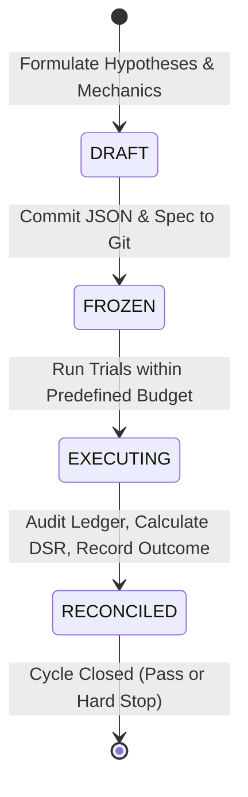

# Quantitative Research Governance & Scientific Integrity Charter

**Effective Date:** 2026-09-05  
**Version:** 1.0.0  
**Scope:** All quantitative research, strategy discovery, statistical backtesting, and data mining within the Bithumb Coin Trader repository.

---

## 1. Fundamental Principles

1. **Reality Over Narrative:** Real execution logs, order book depth, latency, and empirical costs supersede idealized mathematical assumptions.
2. **Strict Multiplicity Accounting:** Every model run, parameter test, feature evaluation, or backtest iteration—whether successful or failed—is an irreversible expenditure of statistical degrees of freedom and MUST be permanently recorded in the research ledger.
3. **No Unrecorded Trials:** "Scratchpad" parameter exploration, silent threshold tuning, and informal backtests without ledger logging are strictly prohibited.
4. **Holdout Sanctity:** Prospective holdout datasets are sealed prior to research and must never be accessed or inspected during the exploratory phase.
5. **Fail-Closed Verification:** A hypothesis is considered null (no edge) until proven otherwise after rigorous deflation adjustments, realistic friction modeling, and independent prospective replication.

---

## 2. Research Preregistration Lifecycle

All research cycles must follow a deterministic 4-stage lifecycle:

1. **DRAFT:**
   - Formal specification of research hypotheses, economic rationale, mathematical feature definitions, parameter search boundaries, trial budget, and execution hurdles.
   - Code artifacts prepared in an isolated research branch.
2. **FROZEN:**
   - Preregistration document and JSON descriptor committed to Git.
   - Cryptographic SHA-256 hash generated and frozen before any data inspection.
   - Holdout partitions cryptographically sealed.
3. **EXECUTING:**
   - Controlled execution of strictly pre-declared parameter combinations.
   - Every execution is appended to the research trial ledger in real time with code commit SHA, dataset hash, execution timestamp, and full metric outputs.
4. **RECONCILED:**
   - Formal audit of the trial ledger against the preregistered budget.
   - Calculation of Family-Wise Error Rate (FWER) and Deflated Sharpe Ratio (DSR) using the verified total trial count.
   - Strategy outcomes categorized as `PASSED`, `FAILED_STATISTICAL_HURDLE`, `FAILED_EXECUTION_HURDLE`, or `REJECTED_OVERFITTING`.

---

## 3. Multiplicity Budgeting & Ledger Immutability

### 3.1 Trial Counting Rules
- A **Trial** is defined as any computation evaluating the predictive relationship between an input feature/signal and future returns, or any portfolio simulation producing PnL/Sharpe metrics.
- The total trial count $N$ across a research program cannot be reset or discounted.
- When computing the Deflated Sharpe Ratio:
  $$\text{DSR} = P\left(Z \le \frac{(\widehat{\text{SR}} - \text{SR}^*) \sqrt{T - 1}}{\sqrt{1 - \widehat{\gamma}_3 \widehat{\text{SR}} + \frac{\widehat{\gamma}_4 - 1}{4} \widehat{\text{SR}}^2}}\right)$$
  the benchmark hurdle $\text{SR}^*$ must incorporate the full count of trials $N$:
  $$\text{SR}^* = \sqrt{\mathbb{V}[\{\widehat{\text{SR}}_n\}]} \left( (1 - \gamma) Z^{-1}\left(1 - \frac{1}{N}\right) + \gamma Z^{-1}\left(1 - \frac{1}{N e}\right) \right)$$
- If the empirical correlation matrix between trial returns is unavailable or unidentifiable, $N_{\text{eff}}$ must be conservatively bounded or reported as `NOT IDENTIFIABLE`, and full nominal $N$ sensitivity must be tabulated.

### 3.2 Research Ledger Specification
- Path: `evidence/research/trial_ledger_frozen_YYYYMMDD.jsonl`
- Format: Append-only JSON Lines.
- Required Schema Fields:
  - `trial_id`: Unique identifier (UUID or sequential).
  - `cycle_id`: Identifier of the preregistration cycle.
  - `timestamp_utc`: Execution timestamp.
  - `git_commit`: Full 40-character commit SHA of code.
  - `dataset_hash`: SHA-256 hash of dataset or data partition descriptor.
  - `strategy_id` / `feature_id`: Pre-registered feature or strategy name.
  - `parameters`: Exact dictionary of hyperparameter values.
  - `sample_start_utc` / `sample_end_utc`: Time boundaries of data used.
  - `metrics`: Dictionary of raw outcomes (trades, gross_return, net_return, sharpe, max_dd, win_rate, fees_paid_krw, slippage_krw).
  - `status`: One of `COMPLETED`, `ABORTED`, `FAILED_HURDLE`.

---

## 4. Holdout Protection & Embargo Rules

1. **Absolute Quarantine:**
   - Holdout data partitions must be stored in distinct directory structures or under cryptographic locks.
   - Automated scripts must verify that input date ranges do not intersect with active holdout intervals.
2. **Serial Purging & Embargo:**
   - Any transition between discovery and validation, or validation and holdout, must enforce a **Purged Embargo Window** (minimum 2 hours for microstructure data, minimum 5 trading days for daily candles) to eliminate spillover from moving-average filters, autoregressive features, and trade queues.
3. **Holdout Access Gate:**
   - Unlocking holdout data requires a formal Git commit recording the final candidate model parameter weights, expected performance envelope, and an immutable pre-unlock signoff.
   - Any model touched after holdout exposure is considered **CONTAMINATED** and ineligible for live deployment.

---

## 5. Stop Rules & Program Termination

1. **Cycle-Level Budget Exhaustion:**
   - If the pre-registered trial budget $N_{\text{max}}$ for a cycle is reached without meeting all statistical and economic hurdles, the cycle terminates immediately with status `FAILED`.
   - Researchers may not increase $N_{\text{max}}$ or create ad-hoc "Cycle 1.1" without returning to the DRAFT phase.
2. **Program-Level Hard Stop:**
   - A research program is allowed a maximum of two consecutive cycles (Cycle 1 and Cycle 2).
   - If Cycle 2 fails to produce an economically viable candidate, a **MANDATORY NO-GO** is declared. The hypothesis is archived as rejected, and research in that feature family ceases until independent prospective data arrives.

---

## 6. Official Taxonomy & Labeling Standards

To maintain total transparency across repository documentation and artifacts, the following exact terminology must be used:

- **`FROZEN RESEARCH BASELINE — ALPHA UNPROVEN`:**
  Must be applied to all existing historical models (including V4 and V6) that have passed unit tests and backtester checks but have not completed preregistered prospective validation.
- **`OBSERVATION`:**
  Raw empirical data directly measured from exchanges or execution logs.
- **`EVIDENCE`:**
  Reproducible quantitative calculation derived from verifiable code and immutable data.
- **`INFERENCE`:**
  Inductive statistical reasoning or hypothesis connecting evidence to theory.
- **`ROOT CAUSE`:**
  Definitively isolated underlying causal mechanism verified by controlled experiment or code inspection.
- **`VERIFICATION`:**
  Direct passing execution of reproducible tests or out-of-sample benchmarks.
