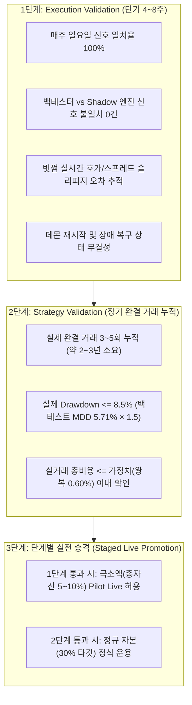

# Strategy V4 저빈도 추세 전략 전진 검증 프로토콜 (Forward Protocol)

- **일자**: 2026-08-25
- **대상 전략**: `v4_adaptive_donchian_atr` (Champion)
- **전략 특성**: 주봉 평가, 60일 고점 돌파, ATR20*3 주간 트레일링 스톱, 30일 저점 청산, 30% 고정 비중
- **목적**: 연 1.2회 거래되는 극단적 저빈도 전략의 특성에 맞추어 **단기 실행 무결성(Execution Validation)**과 **장기 통계적 유의성(Strategy Validation)**을 엄격히 2단계로 분리하여 사전등록함.

---

## 1. 배경 및 설계 원칙

기존의 고빈도 검증 기준(예: "30일 내 30회 완결 거래")은 평균 보유 기간이 48일이고 연간 1.2회 거래하는 V4 전략에 구조적으로 적용할 수 없습니다. 30일 동안에는 단 1회의 진입조차 발생하지 않을 확률이 90% 이상입니다.

따라서 전진 검증을 **시간 기반의 시스템 엔지니어링 검증(Execution)**과 **거래 횟수 기반의 알파 검증(Strategy)**으로 명확히 분리합니다.

---

## 2. 1단계: Execution Validation (시스템 및 실행 무결성 검증)

- **소요 기간**: 4주 ~ 8주 (매주 일요일 최소 4~8회 신호 생성 주기)
- **자금 운용**: Paper Trading (모의 / Shadow Mode, 실제 주문 미발주)
- **통과 기준 (모두 만족 필수)**:
  1. **신호 산출 결정론적 일치율**: 과거 백테스트 엔진과 실시간 Shadow 엔진의 매주 일요일 KST 00:00 기준 산출 신호(`Target Weight`)가 **100% 일치 (불일치 0건)**.
  2. **호가창 및 체결 오차 측정**: 가상 진입/청산 발생 시점의 빗썸 KRW-BTC 최우선 매수/매도 호가와 백테스트 가정 슬리피지(5bps) 간의 괴리가 **10bps 이내**로 유지되는지 확인.
  3. **주문 경로 분리 무결성**: 빗썸 공지사항/시장경보 발생 시 `reference_signals.jsonl`에 정상 기록되면서도 시스템 오작동이 없는지 확인.
  4. **프로세스 재시작 무결성**: 데몬 재시작 후 직전 주간 래칫 트레일링 스톱(`trailing_stop`) 및 포지션 상태가 유실 없이 복원되는지 검증.

---

## 3. 2단계: Strategy Validation (장기 전략 및 알파 검증)

- **소요 기간**: 실제 시장에서 **완결 거래(Round-Trip) 최소 3회**가 누적될 때까지 (약 2~3년 소요 예상)
- **통과 기준 (모두 만족 필수)**:
  1. **최대 낙폭 통제**: Forward 기간 동안의 실제 전략 MDD가 **8.56% 이하** (과거 백테스트 MDD 5.71%의 1.5배 이내)로 유지되어야 함.
  2. **실거래 비용 적합성**: 실제 관측된 왕복 수수료 + 슬리피지가 **0.60% 이내** (스트레스 테스트 3x 범위 내)에 위치해야 함.
  3. **손익비 검증**: 3회 완결 거래 누적 시 평균 손익비(Payoff Ratio)가 **1.5 이상**을 유지해야 함.

---

## 4. 3단계: 단계별 실전 승격 조건 (Staged Live Promotion)

> [!IMPORTANT]
> **성급한 전액 투입 금지 원칙**:
> - 1단계(Execution Validation, 4~8주)를 완벽히 통과하면, 시스템 리스크가 없음을 확인한 상태이므로 **극소액(예: 10만~50만원, 총자본의 5~10%)으로 1차 Pilot Live**를 시작할 수 있습니다.
> - 2단계(Strategy Validation)에서 실제 완결 거래가 누적되고 알파가 실전에서 훼손되지 않음이 확인될 때 비로소 **정규 자본(30% 배분)**으로 점진적 증액(Scale-up)합니다.
