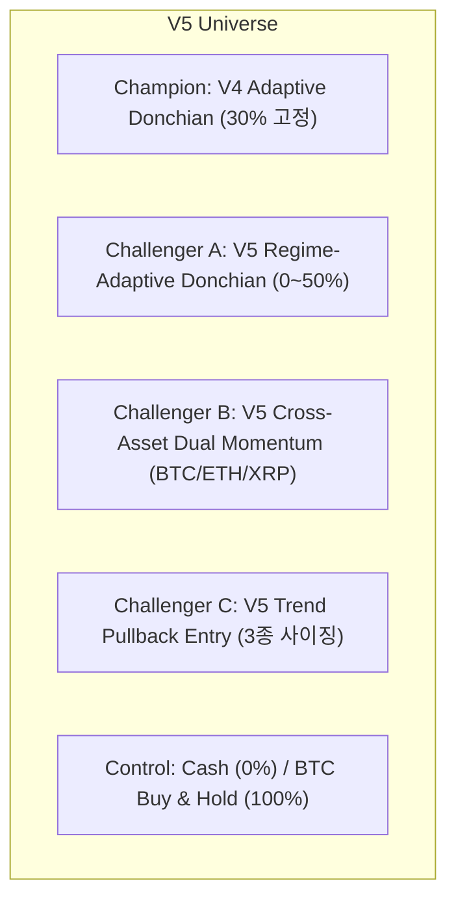

# Strategy V5 연구 프로토콜 사전등록 (Pre-Registration Protocol)

- **등록 일자**: 2026-08-25
- **연구 레인**: Strategy V5 (Regime-Adaptive Sizing, Cross-Asset Dual Momentum, Trend Pullback)
- **원칙**: 모든 가설, 후보군, 포지션 사이징 규칙, 평가 게이트를 백테스트 결과 확인 전에 사전 동결(Freeze)함.

---

## 1. 연구 목적 및 핵심 가설

Strategy V4 감사 결과, `v4_adaptive_donchian_atr`는 60일 고점 돌파 + 주간 ATR Trailing Stop을 통해 단독 OOS에서 우수한 방어력(MDD 5.71%, Sharpe 1.459)을 보였습니다. 그러나 30% 고정 배분(Fixed Allocation) 구조는 강세장에서 업사이드를 충분히 취하지 못하고, 하락장 진입 시 초반 드로다운을 겪는 한계가 있습니다.

V5는 **알파 생성(언제 사고팔지)과 리스크 관리(얼마나 살지)를 분리**하고, 상관성 통제형 다중 자산 모멘텀 및 눌림목 진입을 통해 위험대비 수익률을 극대화합니다.

### 핵심 가설
- **가설 1 (Challenger A)**: Donchian 60/30의 검증된 알파 엔진을 유지하면서, 시장 국면(Market State: Bull/Neutral/Bear/Crash)에 따라 비중을 동적 조절(0%~50%)하면 MDD를 억제하면서 전체 Sharpe와 수익률이 개선될 것이다.
- **가설 2 (Challenger B)**: BTC, ETH, XRP 3종 유니버스에서 절대 모멘텀(90일 > 0) 통과 자산에 한해 Risk-adjusted Relative Momentum 1위에 배분하면 단일 BTC의 횡보/소외 구간을 보완할 것이다.
- **가설 3 (Challenger C)**: 대추세(close > SMA200 & Donchian Bullish) 내에서 단기 과매도(RSI < 35 or close < EMA20) 후 재상승 시점에 진입하면 Donchian의 비싼 돌파 진입 단가를 개선할 것이다.

---

## 2. 사전등록 후보군 구성

모든 전략은 `TargetWeightCandidate` 프로토콜을 준수하며, 일봉 종가 기반으로 매주 일요일(KST)에 신호/비중을 결정합니다.

### [Champion] `v4_adaptive_donchian_atr` (동결 기준)
- **진입**: 60일 Donchian 상단(60일 고점) 돌파 시 LONG
- **청산**: Weekly ATR20*3 Trailing Stop 또는 30일 저점 이탈
- **사이징**: 30% 고정

### [Challenger A] `v5_regime_adaptive_donchian` (최우선 트랙)
- **알파 엔진**: 60일 고점 돌파 진입, ATR20*3 주간 트레일링 스톱 / 30일 저점 청산
- **Market State 분류 (4단계)**:
  - `Trend Filter`: `close > SMA200` AND `momentum_90d > 0`
  - `Volatility Regime`: `realized_vol_30d` (연율화 실현변동성)
  - **상태별 비중 (동적 Allocation)**:
    - **`Bull`** (Trend=True & Vol < 0.60): **40% ~ 50%**
    - **`Neutral/Chop`** (Trend=True & 0.60 <= Vol < 0.90): **20%**
    - **`Bear`** (Trend=False): **0% (Cash)**
    - **`Crash`** (Vol >= 0.90 또는 급락): **0% (Cash)**

### [Challenger B] `v5_cross_asset_dual_momentum`
- **유니버스**: `KRW-BTC`, `KRW-ETH`, `KRW-XRP` (3종 고정)
- **Step 1 (절대 모멘텀 Gate)**: 각 코인의 90일 수익률 `close > close[90d]` 검사
- **Step 2 (적격 자산 선별)**: 절대 모멘텀 > 0 인 자산만 Eligible Pool에 진입
- **Step 3 (상대 모멘텀 랭킹)**: Eligible 자산 중 `Return_90d / Realized_Vol_30d` (샤프형 모멘텀) 1위 자산 선택 -> 30% 배분
- **Step 4 (전체 불합격 시)**: 통과 자산이 0개이면 100% Cash 대기

### [Challenger C] `v5_trend_pullback`
- **대추세 필터**: `close > SMA200` AND `close > closes[60d]`
- **단기 눌림목 포착**: `RSI14 < 35` OR `close < EMA20`
- **재상승 확인 (진입)**: `close > high[1d]` OR `RSI14 cross above 40`
- **청산**: `close < SMA200` OR `close < low[30d]`
- **사이징 3종 분리 실험**:
  - C1: `Fixed 30%`
  - C2: `Volatility Target (25% / realized_vol_30d, max 40%)`
  - C3: `Fractional Kelly (0.25 Kelly)`

### [Track D] 시장경보/뉴스 Risk Overlay (Alpha ❌, Risk Overlay ✅)
- 빗썸 거래유의 지정, 입출금 중단, 가격급등락 경보 발생 시 신규 진입 차단. (주문 실행 엔진과 분리 유지)

---

## 3. 사전등록 Nested CV 및 게이트 기준

Fold 3와 같은 극단적 하락장(BTC -30% 이상)을 왜곡 없이 평가하기 위해 **Bear Fold 인지형 게이트**를 사전에 정의합니다.

### 3.1 Nested CV 구조
- `OUTER_INITIAL_TRAIN = 1320`, `OUTER_TEST = 300`, `OUTER_FOLDS = 3` (총 2,220 개발 봉)
- `INNER_EVIDENCE = 600`, `INNER_FOLD = 200`

### 3.2 Fold별 차등 평가 기준
1. **Bear Fold (해당 Fold 기간 BTC Buy & Hold 수익률 <= -15% 인 경우)**:
   - **전략 MDD <= 해당 기간 BTC MDD × 0.40** (하락폭 40% 이하로 방어)
   - **전략 수익률 >= -5.0%** (현금 대피를 통한 자본 방어 인정)
2. **Bull/Normal Fold (해당 Fold 기간 BTC Buy & Hold 수익률 > -15% 인 경우)**:
   - **전략 수익률 > 0.0%**

### 3.3 전체 Nested Stitched Curve 종합 게이트
- `base_return_positive`: Total Return > 0%
- `cost_x3_return_positive`: 3배 비용 스트레스 Return > 0%
- `maximum_drawdown_lte_15pct`: MDD <= 15.0%
- `nested_sharpe_gte_1`: Sharpe >= 1.0 (또는 고정 30% 벤치마크 대비 Calmar 1.5배 이상)
- `calmar_gte_1`: Calmar Ratio >= 1.0
- `cost_monotone`: 1x >= 2x >= 3x

### 3.4 다중검정 및 DSR 유의성 게이트
- **Deflated Sharpe Ratio (DSR)**: 전체 누적 Trial Ledger($N \ge 67$) 기반 **DSR p-value > 0.05** (또는 Prob > 0.95)
- **White Reality Check**: **p-value <= 0.10**
- **CSCV PBO**: **PBO <= 0.35**
- **Prefix Mismatch**: **0건** (Look-ahead 0건)

---

## 4. 봉인 홀드아웃(180일) 개봉 및 승격 조건

1. V5 연구 종료 시 Champion 및 Challenger A/B/C 중 **단 하나의 최종 Finalist**를 선정.
2. 만약 Challenger A/B/C 중 어떤 전략도 Champion(V4)을 능가하지 못하면 **Champion(`v4_adaptive_donchian_atr`)을 최종 선정**.
3. 최종 선정된 1개 전략에 대해 코드 SHA-256, 파라미터, 게이트 해시를 원장에 기록하고 동결.
4. **180일 봉인 홀드아웃 단 1회 평가 실행**.
