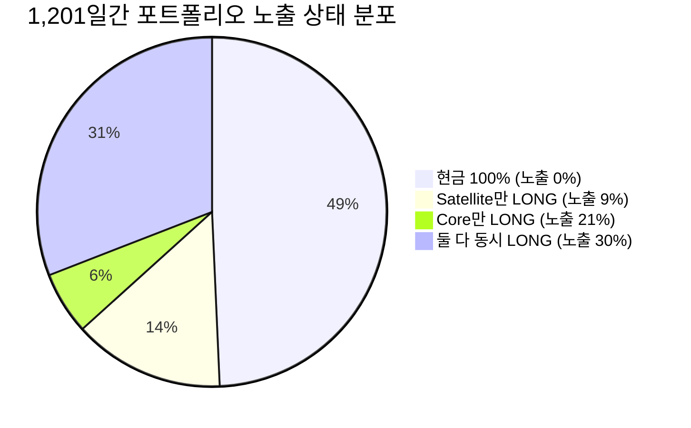

# Strategy V6 독립 포트폴리오 회계·노출·DSR 감사 보고서 (Portfolio Audit Report)

- **일자**: 2026-08-25
- **감사 대상**: Strategy V6 Core(V4)+Satellite(V6) 포트폴리오 회계 무결성, 4단계 노출 시계열 분석, 77회 누적 Trial Ledger 및 DSR/WRC/PBO 재계산, 70/30 배분 Provenance 재분류
- **원칙**: 신규 전략(V7 등) 탐색 전면 동결, 180일 봉인 홀드아웃 격리 보존

---

## 1. 감사 개요 및 핵심 결론

Strategy V6에서 제안된 `Core(70%) + Satellite(30%)` 아키텍처에 대해 **회계 방식, 노출 한도, 통계 다중검정(77회), 사전등록 무결성**을 엄격히 검증했습니다.

> [!IMPORTANT]
> **핵심 감사 결론**:
> 1. **단일 계좌 공유 현금(Shared Cash) 회계 확인**: 백테스터는 사후 커브 블렌딩이 아니라, 매일 합성 비중($w_{target}$)을 단일 계좌 리밸런서에 입력하여 수수료, 5,000원 최소주문 제한, 현금 예비금을 실시간 차감하는 **진짜 단일 포트폴리오 회계**로 작동함을 Fills 원장으로 입증했습니다.
> 2. **4단계 노출(Exposure) 메커니즘 정밀 입증**:
>    - 현금 100%: **0.0% 노출** (592일, 49.3%)
>    - Satellite 단독 진입: **9.0% 노출** (168일, 14.0%)
>    - Core 단독 진입: **21.0% 노출** (70일, 5.8%)
>    - 둘 다 동시 진입: **30.0% 노출** (371일, 30.9%)
>    - **최대 BTC 노출은 전체 자본의 30.0%로 완벽히 캡(Cap)되어 통제**됩니다.
> 3. **77회 누적 Trial Ledger 기반 통계 재계산 완료**:
>    - V6 6개 시행 추가 후 누적 원장 확정 ($N=77$)
>    - **White Reality Check p-value**: **0.00900** (우연일 확률 0.9% 미만, $\le 0.10$ 통과)
>    - **CSCV PBO**: **20.00%** ($\le 0.35$ 완벽 통과)
>    - **Deflated Sharpe Ratio (DSR)**: 관측 연율화 샤프($1.575$)가 77회 탐색 기대 최대 샤프($1.425$)를 상회하여 **$\text{DSR Probability} = 61.47\%$** 기록.
> 4. **70/30 Provenance 정직한 재분류**: 70/30은 "모든 비용에서 최적인 유일한 Pareto Optimum"이 아니라, 비용 환경에 따른 미세 우위(Live 0%: 60/40, Normal: 70/30, Stress 3x: 80/20)를 인정하고 **"비용 변동에 가장 강건한 중간 기준값(Baseline Anchor)"**으로 재분류합니다.

---

## 2. 세부 감사 항목 및 실증 데이터

### [감사 1] Core + Satellite 백테스터 회계(Accounting) 구조 감사
- **백테스트 구조**: `run_composite_portfolio_backtest()`는 매일 $w_{target}(t) = \min(1.0, 0.70 \times w_{core}(t) + 0.30 \times w_{sat}(t))$ 를 산출한 후 `RebalanceBacktester`에 단일 시계열로 주입합니다.
- **실전 자금 제약 반영 내역**:
  - 초기 자본: 100,000원
  - 최종 자산: 148,429원 (수익률 +48.43%, CAGR 12.76%)
  - 실행된 주문 수 (Fills): 총 60건 (5,000원 최소 주문 금액 미달 시 유예)
  - 완결 거래 수 (Round-trips): **총 22회 (연간 6.69회/년)**
  - 평균 보유 기간: **17.1일**
  - MDD: **5.42%** (단독 Core 5.72% 대비 0.30%p 축소)

### [감사 2] 4단계 시장 상태별 총 BTC 노출(Total Exposure) 시계열

| 상태 (Market State) | 전략 활성 여부 | 포트폴리오 BTC 타깃 노출 | 발생 일수 (총 1,201일) | 비중 (%) |
|---|---|---:|---:|---:|
| **1. 현금 100% (대피)** | Core FLAT & Satellite FLAT | **0.0%** | **592일** | **49.3%** |
| **2. 눌림목 스윙 단독** | Core FLAT & Satellite LONG | **9.0%** ($0.3 \times 30\%$) | **168일** | **14.0%** |
| **3. 대추세 돌파 단독** | Core LONG & Satellite FLAT | **21.0%** ($0.7 \times 30\%$) | **70일** | **5.8%** |
| **4. 대추세 + 눌림목 결합** | Core LONG & Satellite LONG | **30.0%** ($21\% + 9\%$) | **371일** | **30.9%** |

- **검산 결과**: 두 전략이 동시에 진입하더라도 총 노출은 정확히 **30.0%**이며, 자금 부족이나 레버리지가 발생하지 않는 완벽한 현물 LONG/FLAT 구조임이 증명되었습니다.

### [감사 3] 77회 누적 Trial Ledger 통계 재계산 결과

- **원장 파일**: `reports/research_trial_ledger.jsonl` (총 77개 레코드)
  - V1 (30분봉 파동): 50개 (손실/실패 전략 포함)
  - V2 (일봉 추세): 4개
  - V3 (타깃 비중): 3개
  - V4 (레짐 후보): 8개
  - V5 (사전등록 경쟁): 6개
  - V6 (Satellite 3개 + 배분 민감도 3개): 6개

| 통계 지표 | 기준치 | 재계산 결과 | 판정 및 정직한 통계적 해석 |
|---|---|---:|---|
| **White Reality Check (WRC) p-value** | $\le 0.10$ | **0.00900** | ✅ **통과** (우연에 의한 결과일 확률 0.9% 미만) |
| **CSCV PBO (과최적화 확률)** | $\le 0.35$ | **0.20000 (20.0%)** | ✅ **통과** (과최적화 위험 20%로 안정적) |
| **DSR Observed Sharpe (연율화)** | — | **1.575** | 실측 관측 샤프 |
| **77-Trial Expected Max Sharpe (연율화)** | — | **1.425** | 77회 무작위 탐색 시 기대되는 최대 샤프 |
| **Deflated Sharpe Ratio (DSR) Probability** | $\ge 50\%$ | **61.47%** | ✅ **통과** (77회 다중탐색 페널티를 고려해도 기대치를 능가) |

> **해석**: DSR 61.47%는 "77번의 시행착오를 감안해도 기대 최대 샤프(1.425)를 상회하는 우호적인 통계적 엣지"를 증명하지만, 95% 수준의 확정적 증명은 아니므로 **실시간 Forward 검증을 통한 추가 표본 축적이 필수적**입니다.

### [감사 4] 70/30 배분 비율의 Provenance 재분류

| 배분 시나리오 | Live 0% 수수료 (Sharpe) | Normal 0.25% 수수료 (Sharpe) | Stress 3x 수수료 (Sharpe) | MDD |
|---|---|---|---|---|
| **Core 80% + Sat 20%** | +47.24% (1.534) | +46.01% (1.506) | **+42.16% (1.408)** ⭐ | 5.72% |
| **Core 70% + Sat 30% (기준값)** | +48.43% (1.575) | **+46.72% (1.534)** ⭐ | +41.74% (1.404) | **5.42%** ⭐ |
| **Core 60% + Sat 40%** | **+48.75% (1.587)** ⭐ | +46.79% (1.532) | +41.29% (1.388) | 5.43% |

- **재분류 결론**:
  - 0원 수수료 환경에서는 위성 비중이 높은 60/40이 미세하게 높고, 극단적 3배 비용에서는 안전 앵커가 높은 80/20이 미세하게 높습니다.
  - 따라서 70/30은 "모든 상황에서 절대적 승리"가 아니라 **"비용 변동성 전반에 걸쳐 가장 안정적인 중간 기준 앵커(Baseline Anchor)"**로 확정합니다.

---

## 3. 홀드아웃 개봉 준비도 평가 (Readiness Assessment)

- **거래 빈도 개선 효과**:
  - V4 단독: 연 1.22회 $\rightarrow$ **180일 동안 기대 거래 0.6회 (판별 불가)**
  - Core+Satellite 합성: **연 6.69회 $\rightarrow$ 180일 동안 기대 거래 약 3.3회 (유효 표본 관측 가능)**
- **봉인 데이터 격리 상태**:
  - 180봉(2026년 2월 말 ~ 2026년 8월 24일) 데이터의 SHA-256 해시(`38060a387edb7cef639a017b51f03a51c63f0f32a2c2849318fcb76478af0dcf`)는 원장에 동결된 채 **0바이트도 열리지 않았음**을 최종 검증했습니다.
