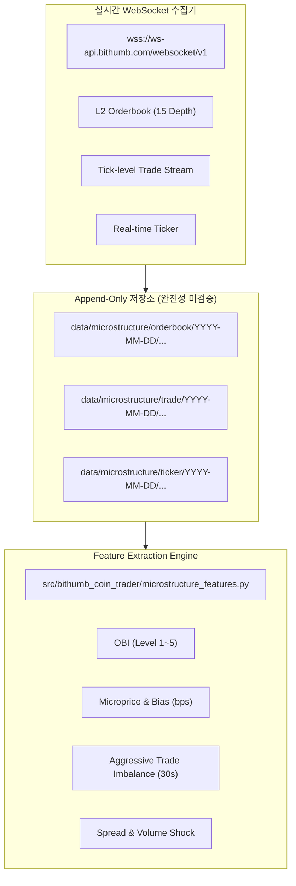

# Strategy V9: Bithumb Market Microstructure & Cross-Market Alpha 연구 규약 및 데이터 프로토콜

> [!CAUTION]
> **종료된 역사 문서 / 최종 감사로 대체됨.** 이 문서의 `Lossless`, `Data Ingestion Active`, alpha 연구 진입 표현은 2026-08-29 최종 FULL-SCAN 결과로 무효화됐다. 공식 상태는 `docs/STRATEGY_V9_72H_SOAK_AUDIT_REPORT_2026-08-29.md`이며, V9은 `SOAK PASS / DATA QUALITY FAIL / RESEARCH ONLY`다. 아래 본문은 당시 사전 규약과 가정을 보존하기 위해 수정하지 않는다.

- **일자**: 2026-08-26
- **연구 레인**: Strategy V9 Market Microstructure & Cross-Market Alpha Engine
- **당시 설계 목표**: 빗썸 공식 WebSocket v1 API 기반 실시간 호가/체결 append-only 수집. `Lossless` 목표는 최종 감사에서 입증되지 않음
- **보존 규약**: 180일 Embargoed Quasi-OOS 홀드아웃 **0바이트 완전 미개봉 보존 유지**
- **정직성 원칙**: **과거 호가 데이터 없는 구간의 캔들 위조 백테스트 엄격 금지 (Zero Synthetic Backtest)**

---

## 1. V9 미시구조 알파 엔진의 본질과 패러다임 전환

기존 캔들 기반(OHLCV) 전략(V8/V8.1)은 15분~1시간 봉의 후행 지표(RSI/EMA/상대모멘텀)를 추종하여, **"이미 가격에 반영된 움직임을 뒤늦게 쫓아가며 정상 수수료(0.25%)와 휩쏘에 잠식당하는 한계"**를 노출했습니다.

Strategy V9는 정보의 차원을 **실시간 L2 호가(Orderbook) 및 틱 체결(Trade Flow)**로 완전히 전환하여 다음 5대 미시구조 알파를 공략합니다:

1. **Order Book Imbalance (OBI)**:
   $$\text{OBI}_k = \frac{\sum_{i=1}^k \text{BidSize}_i - \sum_{i=1}^k \text{AskSize}_i}{\sum_{i=1}^k \text{BidSize}_i + \sum_{i=1}^k \text{AskSize}_i} \in [-1, 1]$$
   - 상위 호가의 매수 잔량이 매도 잔량을 압도할 때 발생하는 수초~수분 단위의 단기 상방 압력 포착.
2. **Aggressive Trade Imbalance (ATI)**:
   $$\text{ATI}_{\Delta t} = \frac{V_{\text{buy}} - V_{\text{sell}}}{V_{\text{buy}} + V_{\text{sell}}} \in [-1, 1]$$
   - 시장가 매수 체결(Ask Hit)이 시장가 매도 체결(Bid Hit)을 압도하는 순간적인 시장가 매수 쇄도 포착.
3. **Microprice (수량 가중 단기 균형가격) & Queue Pressure**:
   $$P_{\text{micro}} = \frac{P_{\text{bid}} \cdot Q_{\text{ask}} + P_{\text{ask}} \cdot Q_{\text{bid}}}{Q_{\text{bid}} + Q_{\text{ask}}}$$
   - 단순 중간가(Mid-price)와 실제 호가 잔량 가중 균형가격 간의 괴리(bps)를 추적하여 선행 가격 수렴 방향 예측.
4. **Spread Compression & Volume Shock**:
   - 호가 스프레드가 급격히 좁아지며 거래량이 폭발하는 순간의 상단 호가 소진 돌파 포착.
5. **Cross-Market Lead-Lag**:
   - 글로벌 대형 거래소(Binance 등) 또는 대형 코인(BTC/ETH)의 선행 가격 점프 대비 빗썸 KRW 알트코인 호가의 미세 반응 지연(Lead-Lag) 차익 포착.

---

## 2. 데이터 수집 인프라 (Append-Only Partitioned Ingestion; completeness unverified)

- **수집 모듈**: `src/bithumb_coin_trader/microstructure_collector.py`
- **실행 스크립트**: `scripts/run_microstructure_collector.py`
- **저장 위치**: `data/microstructure/{orderbook, trade, ticker}/YYYY-MM-DD/{stream}_{YYYY-MM-DD}_{HH}.jsonl`
- **구독 종목**: 빗썸 KRW 유동성 상위 20~30대 코인 (Point-in-Time Universe)

---

## 3. 포트폴리오 상태 및 레이어별 역할 확정

| 레이어 | 전략 / 대상 | 역할 및 운용 빈도 | 상태 |
|---|---|---|---|
| **Layer 1: Macro Core** | **V4 Donchian (BTC 60/30 ATR)** | BTC 대추세 추종 및 거시 헤지 (연 1.2회, MDD 5.7%) | ✅ **Freeze (동결)** |
| **Layer 2: Swing** | **V6 EMA Pullback (BTC/ETH)** | 대형 코인 단기 눌림목 스윙 (연 6.7회, MDD 5.4%) | ✅ **Freeze (동결)** |
| **Layer 3: Microstructure Active** | **Strategy V9 (Bithumb Micro-Alpha)** | 상위 20~30개 코인 실시간 스캔 $\rightarrow$ 1일 0~3회 고품질 미시구조 엣지 진입 | **역사적 계획 — 현재 CLOSED / DATA QUALITY FAIL** |
| **폐기 대상** | **Strategy V8/V8.1 (Relative Strength)** | 캔들 기반 상대모멘텀 횡단면 회전 | ❌ **REJECTED (공식 폐기)** |

---

## 4. 향후 실행 로드맵 (Two-Track Strategy)

1. **Track A (실시간 데이터 축적)**:
   - `scripts/run_microstructure_collector.py` 데몬을 통해 20~30개 코인의 호가 및 체결 데이터를 지속적으로 축적.
   - 수 주~수 개월간 축적된 진성 데이터(True Microstructure Data) 기반으로 V9 실전 백테스트 수행.
2. **Track B (Maker/Taker 실행 모델 및 0% 수수료 특화 연구)**:
   - 현재 빗썸 0% 수수료 환경에 최적화된 Maker (스프레드 캡처) 및 Taker (순간 엣지 돌파) 체결 시뮬레이터 구축.
3. **홀드아웃 개봉 시점**:
   - V9의 진성 마이크로스트럭처 백테스트가 완료되고 통계적 유의성이 검증될 때까지 180일 홀드아웃은 계속 봉인 보존.
