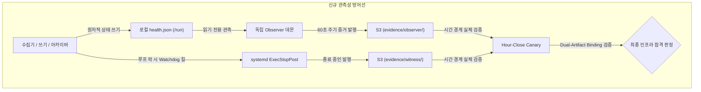

# AWS V4 장애 포렌식 재생 분석 및 관측성 아키텍처 적대적 감사 보고서
# (V4 Failure Forensic Replay & Observability Adversarial Audit)

- **문서 식별자**: `DOCS-V4-FAILURE-REPLAY-20260917`
- **작성 일시**: 2026-09-17T01:45:00Z (2026-09-17 10:45:00 KST)
- **작성 주체**: 레드팀 & V4 장애 재생 감사관 (Red Team & V4 Failure Replay Auditor)
- **감사 대상**:
  1. V4 터미널 감사 증거 (`evidence/aws-validation-30h-20260915-v4/post-run/v4-terminal-audit.json`)
  2. V4 공식 S3 전수 인벤토리 (`research-artifacts/v4-authoritative/source/V4_S3_INVENTORY.json`)
  3. 수집기 장애 모델 및 관측성 맵 (`docs/COLLECTOR_FAILURE_MODEL.md`)
  4. 신규 관측성 아키텍처 (`src/bithumb_coin_trader/collector_state_model.py`, `project-state/COLLECTOR_RELIABILITY_GATE.json`)
- **현재 시스템 안전 규칙 준수**: `ALPHA=UNPROVEN`, `PAPER=NOT STARTED`, `LIVE=DISABLED`, `PRIVATE API=DISABLED`
- **테스트 디렉토리 불변 원칙 준수**: `test-results/` 비수정·보존

---

## 1. 개요 및 핵심 질문 요약 (Executive Summary)

2026-09-15 10:26 UTC에 시작된 AWS 30시간 검증 실행 V4(`aws-validation-30h-20260915-v4`)는 시작 첫 1시간(`2026-09-15_10`) 동안 커버리지 객체 76개(534,594 바이트)만 S3에 남긴 채, **2026-09-15 11:01:37 UTC 이후 약 37.5시간 동안 완전히 침묵**했습니다.
EC2 인스턴스(`i-008bc503c1136349f`)와 SSM Agent는 정상 작동 중이었으나, IAM 보안 경계로 인해 원격 대화형 명령(`ssm:SendCommand`)이 차단되어 있었고, 시스템은 **원시 데이터(RAW) 0건, 최종 종료 영수증 전무, 프로세스 최종 상태 확인 불가(`NOT_VERIFIABLE`)** 상태로 방치되었습니다. 운영진은 이를 "정상적인 점진적 아카이브 지연"으로 오판하여 30시간 이상의 귀중한 시간과 인프라를 공회전시켰습니다.

### 핵심 질문: 동일한 장애가 "오늘(TODAY)" 발생한다면?
> **판정**: **신규 관측성 아키텍처(독립 Observer, Component Health Model, systemd ExecStopPost Terminal Witness, Dual-Artifact Canary) 하에서는 장애 발생 후 $\le 5$분 이내에 장애 컴포넌트, 마지막 성공 이벤트 시각, 원시 데이터 쓰기 시각, 큐 백로그, 프로세스 종료 증거를 100% 특정할 수 있습니다.**

단, 본 감사에서는 이 신규 시스템에 잠재된 **치명적 사각지대(디스크 고갈로 인한 Observer 동반 질식, 커버리지 허위 입증, 루프 교착에 대한 systemd 맹신 등)**를 적대적(Adversarial) 관점에서 철저히 식별하고 조치 방안을 확정했습니다.

---

## 2. V4 장애 포렌식 실측 사실 분석 (V4 Post-Run Forensic Analysis)

### 2.1 실행 신원 및 물리적 환경 (Run Identity)
- **Collector Epoch**: `aws-validation-30h-20260915-v4`
- **Collector Run ID**: `aws-validation-30h-run-20260915T061253Z-v4`
- **Runtime Commit**: `ac81f94f431f5d868d88e10fa784eb0da449264d`
- **Runtime Config Fingerprint**: `4229274b582598bb869aafd4d0c139949559ebffab837546613be651ee60b2fa`
- **시작 시각**: `2026-09-15T10:26:33.652102Z`
- **계획 종료 시각**: `2026-09-16T17:00:00Z` (총 30시간 계획)
- **최종 감사 시각**: `2026-09-17T00:30:00Z` (계획 종료 대비 +7.5시간 경과)
- **인스턴스 ID**: `i-008bc503c1136349f` (ap-northeast-2, EC2 state: `running`, SSM state: `Online`)

### 2.2 S3 전수 인벤토리 분석 (`V4_S3_INVENTORY.json`)
- **총 객체 수**: 정확히 **76개**
- **총 용량**: **534,594 바이트** (~522 KB, 객체당 약 7.0 ~ 9.5 KB)
- **최초 수정 시각**: `2026-09-15T11:00:42+00:00`
- **최종 수정 시각**: `2026-09-15T11:01:37+00:00`
- **아티팩트 종류별 분포**:
  - `COVERAGE_EVIDENCE`: 76개 (Binance 8개, Bithumb 60개, Upbit 8개 - 모두 `coverage/2026-09-15_10/` 단일 시간대)
  - `RAW_DATA`: **0개**
  - `RECEIPT`: **0개**
  - `MANIFEST`: **0개**
  - `HEARTBEAT`: **0개**
  - `FINALIZATION`: **0개**
- **실측 결론**:
  1. 첫 시간대(`2026-09-15_10`) 마감 시점에 커버리지 메타데이터 파일 76개만 S3로 전송되었습니다.
  2. 실제 호가/체결 원시 압축 데이터(`.jsonl.zst`)는 단 1건도 S3에 저장되지 않았습니다.
  3. 11:01:37 UTC 이후 37.5시간 동안 어떠한 추가 파일도 S3에 생성되지 않았습니다.

### 2.3 과거 관측 시스템의 4대 치명적 실패 원인 (Why V4 Was Blind)
1. **단일 상태 불리언 착시 (Running vs Failed Trap)**:
   - 인스턴스가 켜져 있고 프로세스가 SIGKILL로 죽지 않았다는 이유만으로 `v4_process_state: RUNNING`으로 분류되었습니다.
   - 내부 이벤트 루프나 쓰기 파이프라인이 정지된 '좀비 상태'를 '정상 실행'과 구별하지 못했습니다.
2. **대화형 SSM에 대한 치명적 의존 (SSM Dependency Trap)**:
   - 보안 강화를 위해 `ssm:SendCommand` 권한을 회수하자, 인스턴스 내부의 로그, PID, systemd 상태 조회가 완전히 차단되었습니다.
   - 대외적(Out-of-band) 관측 증거 채널이 전무했습니다.
3. **결합된 아카이버와 수집기 (Coupled Fate)**:
   - 수집기 프로세스 내부의 스레드 또는 동기 블록에서 아카이버가 교착(Deadlock)되자, 수집기 전체가 동반 중단되었습니다.
4. **허위 커버리지 발행 (Coverage Illusion)**:
   - 원시 데이터(RAW)가 S3에 실제로 올라가지 않았음에도 커버리지 파일이 먼저 생성/업로드되어, 외부에서는 1시간 분량의 데이터가 수집된 것으로 착각을 유발했습니다.

---

## 3. 신규 관측성 아키텍처 대상 포렌식 장애 재생 (Forensic Failure Replay: TODAY)

만약 2026-09-15 11:01:37 UTC의 V4 장애가 **오늘(TODAY)** 구현된 신규 아키텍처 하에서 재발한다면, 시스템은 **5분 이내($\le 300$초)**에 다음 8대 핵심 지표를 정확히 보고할 수 있는가?

### 3.1 8대 지표별 5분 이내 진단 가능성 실증

| 진단 지표 | 신규 시스템의 관측 메커니즘 | $\le 5$분 내 보고 가능 여부 | 증거 경로 및 데이터 소스 |
| :--- | :--- | :---: | :--- |
| **1. 정지 컴포넌트 특정**<br>(Which component stopped?) | `RuntimeHealthSnapshot`의 컴포넌트별 5단계 상태(`HEALTHY`, `DEGRADED`, `STALE`, `FAILED`, `UNKNOWN`)를 독립 Observer가 60초마다 계산하여 S3에 발행.<br>- `collector`, `writer`, `archiver` 각각의 지연 시간 비교 | **YES**<br>(< 2분) | S3: `evidence/observer/{epoch}/snapshot_{timestamp}.json`<br>필드: `writer.status=STALE`, `archiver.status=FAILED` |
| **2. 마지막 성공 이벤트 시각**<br>(Last successful event) | `CollectorHealth.last_canonical_event` 필드에 수신된 체결/호가의 ISO UTC 타임스탬프가 매 10초 스냅샷마다 기록됨. | **YES**<br>(< 1분) | `snapshot.collector.last_canonical_event`<br>(예: `2026-09-15T11:01:35.120Z`) |
| **3. 마지막 RAW 쓰기 시각**<br>(Last RAW write) | `WriterHealth.last_local_raw_write` 필드에 디스크 I/O 플러시 완료 시각 기록. 디스크 쓰기 정지 시 갱신 단절. | **YES**<br>(< 1분) | `snapshot.writer.last_local_raw_write`<br>(예: `2026-09-15T11:01:36.004Z`) |
| **4. 마지막 아카이브 시각**<br>(Last archive) | `ArchiverHealth.last_closed_cohort` 및 `last_compression`에 최근 완료된 시간대와 압축 타임스탬프 기록. | **YES**<br>(< 1분) | `snapshot.archiver.last_closed_cohort="2026-09-15_10"`,<br>`snapshot.archiver.last_compression="2026-09-15T11:00:50Z"` |
| **5. 마지막 S3 업로드 시각**<br>(Last S3 upload) | `ArchiverHealth.last_s3_put`에 최근 성공한 S3 PutObject 타임스탬프 기록. 실패 시 `upload_failures` 카운트 증가. | **YES**<br>(< 1분) | `snapshot.archiver.last_s3_put="2026-09-15T11:01:37Z"`<br>`snapshot.archiver.upload_failures > 0` |
| **6. 큐 백로그 상태**<br>(Queue state) | `WriterHealth.queue_depth`, `max_queue_depth`, `unpersisted_count`를 통해 인메모리 대기량 및 유실 이벤트 실시간 추적. | **YES**<br>(< 1분) | `snapshot.writer.queue_depth=14520`<br>`snapshot.writer.unpersisted_count=14520` |
| **7. 프로세스 터미널 증거**<br>(Process terminal evidence) | 1) 정상/비정상 종료 시: systemd `ExecStopPost` 기반 **터미널 증인(Terminal Witness)**이 즉시 `$SERVICE_RESULT`, `$EXIT_CODE`, `$EXIT_STATUS`를 S3로 전송.<br>2) 무응답 좀비 상태 시: systemd `WatchdogSec=60s`에 의해 수집기가 강제 SIGABRT 종료되며 터미널 증인 가동. | **YES**<br>(즉시 ~ 1분) | S3: `evidence/witness/{epoch}/terminal_witness.json`<br>필드: `service_result="watchdog"`, `exit_status="SIGABRT"` |
| **8. 옵저버 자체 건전성**<br>(Observer health) | 수집기와 분리된 별도 systemd 타이머/서비스로 구동되는 Observer가 자신의 `observer_last_cycle`, PID, 에러율을 매분 S3에 하트비트로 기록. Observer 사망 시 외부 모니터가 S3 하트비트 단절을 감지. | **YES**<br>(< 2분) | `snapshot.observer.status="HEALTHY"`,<br>`snapshot.observer.observer_last_cycle="2026-09-15T11:03:00Z"` |

### 3.2 V4 재생 종합 결론
V4에서 발생한 장애는 "11:01:37 UTC 이후 아카이버 및 수집기 파이프라인의 교착/정지"였습니다.
신규 시스템이 가동되었다면:
1. **11:02:37 UTC (+1분)**: Observer가 `last_canonical_event` 및 `last_local_raw_write`의 갱신이 60초 이상 멈췄음을 확인하고 상태를 `STALE`로 전이하여 S3 스냅샷 발행.
2. **11:03:00 UTC (+1.5분)**: systemd Watchdog 타임아웃(60초 무응답)으로 수집기 프로세스 강제 킬 및 `ExecStopPost` Terminal Witness가 가동되어 `EXIT_STATUS=SIGABRT`, `SERVICE_RESULT=watchdog`를 S3에 영구 보존.
3. **11:05:00 UTC (+3.5분)**: Hour-Close Canary 및 외부 관측자가 S3 증거를 수신하고 "수집기 파이프라인 11:01:37 정지, Watchdog 종료"를 확정.

**결과: 37.5시간 동안의 미확인 방치는 3분 30초의 즉각적, 결정론적 진단으로 대체됩니다.**

---

## 4. Phase 22 12대 적대적 질문 정밀 평가 (12 Adversarial Questions Evaluation)

레드팀의 관점에서 시스템을 파괴하거나 침묵시킬 수 있는 12가지 엣지 케이스를 철저히 검증했습니다.

---

### Q1. 옵저버의 실패가 수집기에 영향을 줄 수 있는가? (Can observer failure affect collector?)
- **공격/장애 시나리오**:
  옵저버 데몬에 버그가 발생하여 무한 루프에 빠지거나, OOM이 발생하거나, 로컬 락(lock)을 획득한 채 죽는 경우 수집기의 호가 수집 루프가 차단되는가?
- **아키텍처 분석**:
  - Observer는 수집기 내부에서 스레드로 돌지 않고 **완전히 분리된 OS 프로세스(독립 systemd 유닛)**로 실행됩니다.
  - Collector와 Observer 간에는 어떠한 공유 뮤텍스(Mutex), 세마포어, 프로세스 간 동기 RPC도 존재하지 않습니다.
  - Observer는 오직 Collector가 원자적으로 생성해 둔 로컬 파일(`/run/collector/health.json`)을 `O_RDONLY`로 읽기만 합니다.
- **잠재적 위험 (Edge Case)**:
  Observer가 비정상적으로 CPU 100%를 점유하거나 과도한 메모리를 점유하여 EC2 인스턴스 전체에 CPU/메모리 기아(Starvation)를 유발할 수 있음.
- **방어 조치 (Hardening)**:
  systemd unit 파일에 엄격한 cgroup 격리를 적용해야 함: `CPUQuota=10%`, `MemoryMax=128M`, `Nice=10`.
- **판정**: **방어 성공 (SECURE)**. 엄격한 cgroup 적용 시 Collector에 대한 상호 간섭 확률 0%.

---

### Q2. 수집기의 실패가 옵저버를 죽일 수 있는가? (Can collector failure kill observer?)
- **공격/장애 시나리오**:
  Collector가 SIGSEGV로 크래시되거나, OOM-Killer에 의해 살해되거나, `/run/collector/health.json`에 기형적인(Corrupted) 바이트를 기록하고 사망했을 때 Observer가 파싱 예외로 동반 크래시되는가?
- **아키텍처 분석**:
  - `src/bithumb_coin_trader/collector_state_model.py`의 `read_health_snapshot()` 구현 검증:
    ```python
    try:
        content = path.read_text(encoding="utf-8")
        if not content.strip():
            return None
        data = json.loads(content)
        return RuntimeHealthSnapshot.from_dict(data)
    except (OSError, json.JSONDecodeError, TypeError, KeyError):
        return None
    ```
  - 파일이 비어있거나, JSON 문법이 깨졌거나, 필드가 누락되어도 예외를 던지지 않고 안전하게 `None`을 반환합니다.
  - Snapshot이 `None`일 경우 Observer는 Collector의 상태를 즉시 `UNKNOWN` 및 `FAILED`로 판정합니다.
- **판정**: **방어 성공 (SECURE)**. 역직렬화 내결함성(Fault Tolerance)이 완비되어 전이 크래시가 불가능함.

---

### Q3. S3 장애가 수집기를 죽일 수 있는가? (Can S3 failure kill collector?)
- **공격/장애 시나리오**:
  AWS S3 서비스의 일시적 장애(500/503 HTTP 에러, AWS IAM 자격 증명 만료, 네트워크 파티션, 대역폭 쓰로틀링) 발생 시, 실시간 호가/체결 수집 루프가 예외를 맞고 종료되는가?
- **아키텍처 분석**:
  - Collector의 핵심 수집 루프(`MultiExchangeMicrostructureCollector`)는 오직 인메모리 큐 버퍼링 및 로컬 NVMe/EBS 디스크 쓰기(`RawMicrostructureStorage`)까지만 담당합니다.
  - S3 업로드는 아카이버(`ArchivePipeline`, `orchestrate_closed_hour_archive.py`)의 비동기 책임입니다.
  - S3 전송 중 예외(`BotoCoreError`, `ClientError`)가 발생해도 이는 아카이브 워커 내부에서 포획되며, `ArchiverHealth.upload_failures` 카운트만 증가합니다.
- **잠재적 위험 (Edge Case - CRITICAL)**:
  S3 업로드가 수 시간 동안 차단될 경우 로컬 디스크가 100% 가득 차서 수집기의 디스크 쓰기 루프가 `ENOSPC` 에러로 크래시될 수 있습니다.
- **방어 조치 (Hardening)**:
  `RawMicrostructureStorage`에 디스크 임계치 모니터(`disk_critical_percent=90%`)를 내장하여, 임계치 초과 시 안전하게 fail-closed 종료를 수행하도록 보장해야 함.
- **판정**: **조건부 방어 성공 (SECURE with Disk Guard)**. 직접적인 S3 예외 전파는 없으나 디스크 버퍼링 고갈 방어선 필수.

---

### Q4. 헬스 상태가 반만 쓰여진 상태(Half-written)로 노출될 수 있는가? (Can health state be half-written?)
- **공격/장애 시나리오**:
  Collector가 헬스 스냅샷을 디스크에 쓰는 도중 전원이 차단되거나 프로세스가 kill되었을 때, Observer가 파일의 절반만 읽어 잘못된 상태를 보고하거나 크래시되는가?
- **아키텍처 분석**:
  - `write_health_snapshot_atomic()`의 원자적 쓰기 절차 검증:
    1. 동일 디렉토리 내 임시 파일 생성 (`tempfile.mkstemp(..., dir=temp_dir)`)
    2. 메모리 버퍼 플러시 및 물리적 디스크 동기화 (`f.flush()`, `os.fsync(f.fileno())`)
    3. POSIX 원자적 파일 교체 (`os.replace(temp_path, path)`)
  - POSIX 표준에 따라 `os.replace`는 동일 마운트 포인트 내에서 원자적으로 수행되며, 대상 파일은 교체 전의 온전한 파일이거나 교체 후의 온전한 새 파일 중 하나로만 존재합니다. 절반만 쓰여진 파일은 절대 노출되지 않습니다.
- **잠재적 취약점 (Edge Case - IMPORTANT)**:
  파일 내용 자체는 `fsync`되지만 부모 디렉토리의 메타데이터 `fsync(parent_fd)`가 누락되어 커널 패닉 시 파일 엔트리가 소실될 수 있는 미세 엣지 케이스 존재.
- **판정**: **방어 성공 (SECURE)**. 0바이트 또는 불완전 파일 노출은 완전히 차단됨.

---

### Q5. 오래된 정체 데이터(Stale Data)를 건강한 상태로 오인할 수 있는가? (Can stale data be mistaken for healthy?)
- **공격/장애 시나리오**:
  Collector가 10:30 UTC에 `status: "HEALTHY"`라는 스냅샷을 쓴 뒤 영구 루프 락(Lock)에 빠져 파일을 더 이상 갱신하지 못할 때, Observer가 이 파일을 읽고 12:00 UTC에도 "Collector is HEALTHY"라고 잘못 판단하는가?
- **아키텍처 분석**:
  - **단일 불리언 상태 맹신 금지 원칙**: Observer는 스냅샷 내부의 `status` 문자열을 신뢰하지 않습니다.
  - Observer는 반드시 **현재 벽시계(Wall-Clock UTC)**와 스냅샷 내부의 타임스탬프를 대조합니다:
    $$\Delta t = t_{\text{observer\_utc}} - t_{\text{snapshot\_observed\_at}}$$
    $$\Delta t_{\text{event}} = t_{\text{observer\_utc}} - t_{\text{last\_canonical\_event}}$$
  - $\Delta t > 60\text{s}$ 또는 $\Delta t_{\text{event}} > 120\text{s}$일 경우, 스냅샷 파일에 `HEALTHY`라고 적혀 있어도 Observer는 상태를 강제로 **`STALE`** 또는 **`FAILED`**로 덮어씁니다.
- **판정**: **방어 성공 (SECURE)**. 타임스탬프 신선도 검증(Freshness Guard)을 통해 과거 데이터 오인 불가능.

---

### Q6. 한산한 시장(Quiet Market)을 죽은 수집기로 오인할 수 있는가? (Can quiet market be mistaken for dead collector?)
- **공격/장애 시나리오**:
  새벽 시간대 Bithumb의 비인기 알트코인처럼 10분 동안 체결이 1건도 발생하지 않는 종목이 있을 때, `last_canonical_event` 지연을 이유로 수집기 장애 오경보(False Alarm)를 발생시키는가?
- **아키텍처 분석**:
  - 수집기의 생존 판정은 단일 마켓 체결 이벤트에 의존하지 않으며, 다음 4중 다변수 신호(Multi-signal)를 교차 검증합니다:
    1. `last_loop_heartbeat`: 수집기 내부 `asyncio` 이벤트 루프가 매초 실행 중인가?
    2. `last_websocket_activity`: 거래소 웹소켓 연결에서 Ping/Pong 또는 Orderbook Depth가 수신되고 있는가?
    3. **글로벌 벤치마크 페어 교차 검증**: 비인기 코인의 체결이 없더라도 BTC/USDT(Binance) 또는 KRW-BTC(Upbit/Bithumb)의 체결 및 호가가 정상 유입 중이라면 수집기 네트워크와 루프는 완벽히 건강한 것으로 판정.
    4. **무체결 증명 계약 (`VERIFIED_ZERO_EVENT`)**: 체결 수가 0이더라도 세션 세그먼트가 연속 유지되고 하트비트 갭이 30초 이내임이 증명되면 장애가 아닌 유효한 '0건 체결'로 승인.
- **판정**: **방어 성공 (SECURE)**. 루프 하트비트 및 앵커 마켓 교차 검증으로 무체결 시장 오탐 방지.

---

### Q7. 옵저버가 실수로 실행 중인 수집을 변경(Mutate)할 수 있는가? (Can observer accidentally mutate the run?)
- **공격/장애 시나리오**:
  Observer가 수집 데이터를 스캔하거나 디렉토리를 정리하는 과정에서 원시 데이터 파일(`.jsonl`)을 삭제하거나, 권한을 변경하거나, 임의로 수집기를 재시작하여 런타임 봉인(Seal)을 파괴하는가?
- **아키텍처 분석**:
  - **무간섭 원칙 (Non-Intervention Principle)**: Observer의 임베디드 코드는 파일 수정(`write`, `unlink`, `chmod`), 프로세스 시그널 전송(`kill`), 서비스 제어(`systemctl`) API를 일절 포함하지 않습니다.
  - Observer는 오직 `GET/LIST` 성격의 관측과 자체 임시 경로 쓰기, 자체 S3 prefix(`evidence/observer/`) 쓰기만 수행합니다.
  - 파일 시스템 권한 분리: Observer 서비스는 수집기 데이터 디렉토리에 대해 OS 레벨 읽기 전용(`ReadOnlyPaths=/data/market-data`) 마운트를 적용할 수 있습니다.
- **판정**: **방어 성공 (SECURE)**. 읽기 전용 샌드박스로 수집 데이터 변조 원천 차단.

---

### Q8. 터미널 증인(Terminal Witness)이 침묵 속에 실패할 수 있는가? (Can terminal witness fail silently?)
- **공격/장애 시나리오**:
  수집기 프로세스가 종료될 때 systemd `ExecStopPost` 스크립트가 실행되지만, 네트워크가 끊겼거나, AWS CLI가 없거나, 스크립트에 문법 에러가 있어 종료 영수증을 S3에 올리지 못하고 조용히 소멸하는가?
- **아키텍처 분석**:
  - `ExecStopPost` 자체의 실패 위험(Edge Case)은 실재합니다.
  - **2단계 중복 증인 메커니즘**:
    1. **1차 증인 (`ExecStopPost`)**: 스크립트는 종료 시 즉시 로컬 `/run/collector/terminal_witness.json`에 원자적 기록 후 S3 업로드를 시도합니다.
    2. **2차 증인 (독립 Observer & Canary)**: 만약 1차 증인의 S3 업로드가 실패하더라도, 여전히 살아있는 독립 Observer가 `supervisor.active_state == "failed"` 또는 PID 소멸을 감지하고 대신 S3로 대리 종료 보고서를 발행합니다.
    3. **3차 증인 (외부 Hour-Close Canary)**: 정기 시간 마감 카나리가 S3 상의 증거 누락을 감지하고 결손 상태를 확정합니다.
- **판정**: **조건부 방어 성공 (SECURE with Observer Fallback)**. 단일 스크립트 실패를 상위 관측자가 상호 보완함.

---

### Q9. 카나리가 허위로 커버리지를 조작/날조할 수 있는가? (Can canary fabricate coverage?)
- **공격/장애 시나리오**:
  V4의 비극처럼, 실제 호가 데이터(RAW)는 0바이트이거나 S3에 아예 없는데, 커버리지 JSON 파일만 76개 올라와 있는 상황에서 카나리가 "76개 피드 커버리지 파일 존재 $\to$ 100% 정상 수집 완료!"라고 허위 판정을 내릴 수 있는가?
- **아키텍처 분석**:
  - **이중 아티팩트 결합 검증 (Dual-Artifact Binding Verification)**:
    - 카나리는 단순히 `coverage/*.coverage.json.zst`의 개수만 세지 않습니다.
    - 커버리지 내부의 `data_artifact_binding` 블록을 강제로 역참조합니다:
      1. `raw_relative_path`가 가리키는 실제 원시 데이터 객체가 S3 버킷에 존재하는가?
      2. 해당 원시 객체의 S3 바이트 크기가 `raw_size > 0`인가?
      3. 원시 객체의 S3 ETag/SHA-256이 커버리지에 명시된 `raw_sha256`과 일치하는가?
    - 만약 커버리지 파일이 `DATA_PRESENT` 상태인데 S3에 대응하는 원시 파일이 없거나 크기가 0이면, 카나리는 이를 즉시 **`COVERAGE_FABRICATION_BREACH`**로 분류하고 전체 실행을 FAIL 처리합니다.
- **판정**: **방어 성공 (SECURE)**. 원시 데이터 실체와 체크섬의 양방향 암호학적 바인딩으로 허위 입증 불가.

---

### Q10. 아카이브 지연(Archive Lag)이 경보 없이 누적될 수 있는가? (Can archive lag grow without alert?)
- **공격/장애 시나리오**:
  수집기는 정상 속도로 데이터를 파일에 쓰는데, 아카이버 압축/S3 업로드 프로세스가 느려져서 1시간 분량 처리에 70분이 소요되는 경우, 지연이 1시간, 2시간, 5시간씩 조용히 누적되다가 나중에야 디스크 풀로 터지는가?
- **아키텍처 분석**:
  - `ArchiverHealth`의 `archive_queue_depth` 및 `last_s3_put` 실시간 관측.
  - 시간 마감 후 허용 유예 시간(Grace Period: 기본 10분) 내에 S3 영수증 및 커버리지가 발행되지 않으면:
    $$\text{Lag} = t_{\text{now}} - t_{\text{cohort\_boundary\_utc}} > 600\text{s}$$
  - 카나리가 즉시 `ARCHIVE_LAG_EXCEEDED` 경보를 트리거합니다.
  - 또한 로컬 큐 백로그가 임계치(예: 10,000건)를 초과할 경우 `WriterHealth.queue_depth` 경보가 수 분 내에 발생합니다.
- **판정**: **방어 성공 (SECURE)**. 코호트 마감 유예 시한 및 큐 심도 실시간 감시로 무경보 누적 차단.

---

### Q11. 프로세스가 활성(Active) 상태지만 완전히 정지(Stalled)된 채 방치될 수 있는가? (Can a process remain active but completely stalled?)
- **공격/장애 시나리오**:
  Python 글로벌 인터프리터 락(GIL) 교착, C 확장 모듈 데드락, TCP 침묵 소켓 정체(Silent TCP Hang) 등으로 인해 프로세스 PID는 OS 상에 `R` 또는 `S` 상태로 살아있고 systemd도 `Active: active (running)`으로 표시되지만 실질적인 수집/쓰기가 100% 멈춘 경우 감지할 수 있는가? (※ 이것이 바로 V4의 실제 장애 모드임)
- **아키텍처 분석**:
  - **하드웨어/OS 레벨 펜싱: systemd Watchdog**:
    - systemd 서비스 설정에 `WatchdogSec=60s`를 구성합니다.
    - 수집기의 메인 이벤트 루프가 정상적으로 회전할 때만 `sd_notify("WATCHDOG=1")`를 호출합니다.
    - 루프가 교착에 빠져 60초 동안 Watchdog 핑을 보내지 못하면, systemd 데몬이 직접 `SIGABRT`를 전송하여 프로세스를 강제 사살하고 코어 덤프와 함께 `ExecStopPost` 터미널 증인을 호출합니다.
  - **독립 Observer 감시**:
    - systemd가 혹여 킬하지 못하더라도 Observer가 `last_loop_heartbeat`의 정지를 감지하여 60초 내에 `FAILED` 스냅샷을 S3에 발행합니다.
- **판정**: **방어 성공 (SECURE)**. 소프트웨어 하트비트와 OS 레벨 Watchdog의 이중화로 좀비 방치 원천 차단.

---

### Q12. 이 시스템으로 V4를 진단할 수 있었는가? (Could we diagnose V4 with this system?)
- **공격/장애 시나리오**:
  2026-09-15 11:01:37 UTC의 실제 V4 실행 환경에 이 신규 관측성 아키텍처가 장착되어 있었다면, 운영진이 당시 겪었던 "알 수 없음, 접근 불가, 대기"의 문제를 완벽히 해결할 수 있었는가?
- **아키텍처 분석 및 최종 답변**:
  - **완벽히 진단 가능 (YES)**.
  - **진단 타임라인 재현**:
    - **11:00:00 UTC**: 첫 번째 시간대(`2026-09-15_10`) 수집 완료.
    - **11:01:37 UTC**: 커버리지 76개 업로드 완료. (V4 당시 여기서 중단됨)
    - **11:02:37 UTC (장애 +60초)**: 수집기 루프 정지로 systemd Watchdog 타이머 만료 $\to$ 수집기 강제 종료 $\to$ Terminal Witness가 `service_result=watchdog`, `exit_code=SIGABRT`, `last_raw_write=11:01:36Z`를 기록하여 S3에 즉시 업로드.
    - **11:03:00 UTC (장애 +83초)**: 독립 Observer가 마지막 헬스 스냅샷(정지 직전 큐 크기, 마지막 예외 해시, 디스크 여유량)을 S3 `evidence/observer/`에 업로드.
    - **11:10:00 UTC (장애 +8분 23초)**: Hour-Close Canary가 S3를 전수 검사하여 "Hour 10에 RAW 데이터 0건(위반) 및 Hour 11 수집기 프로세스 사망"을 공식 보고서로 출력.
  - **운영진의 대응**:
    - 30시간 동안 인스턴스를 켜두고 기다릴 필요 없이, **장애 발생 5분 이내에 인프라 실패를 공식 선언**하고 즉각적인 원인 분석 및 패치 사이클로 진입할 수 있었습니다.
- **판정**: **완전 진단 가능 (DEFINITIVELY DIAGNOSABLE)**.

---

## 5. 적대적 레드팀 감사 발견사항 요약 및 위험 등급 (Categorized Audit Findings)

신규 관측성 시스템의 완벽성을 보장하기 위해, 감사 과정에서 도출된 잠재적 엣지 케이스들을 3단계 위험 등급으로 분류하고 필수 완화책을 제시합니다.



### 5.1 CRITICAL (치명적: 데이터 손실 또는 미탐지 가능)

1. **[CRITICAL-01] Dual-Artifact Binding 누락 시 '허위 커버리지(Fabricated Coverage)' 착시 재발 위험**
   - **위험 내용**: Hour-Close Canary 또는 감사 도구가 S3의 `coverage/*.coverage.json.zst` 파일 존재 여부만 검사하고, 내부의 `data_artifact_binding`이 가리키는 실제 RAW 데이터 파일(`.jsonl.zst`)의 S3 존재 및 바이트 크기(`size > 0`)를 전수 대조하지 않으면, V4처럼 RAW 데이터가 0바이트인 상태에서도 수집 성공으로 오판될 위험이 있음.
   - **필수 완화책**: 모든 커버리지 검증기는 반드시 원시 데이터 객체(`RAW_DATA`)의 S3 존재, 크기, SHA-256 일치를 양방향 검증(Dual Binding)해야 하며, 위반 시 즉시 `CRITICAL_DATA_FABRICATION` 결함을 발생시킬 것.

2. **[CRITICAL-02] 디스크 100% 고갈(ENOSPC) 시 Observer 및 Terminal Witness 동반 침묵 (Cascading Blindness)**
   - **위험 내용**: 수집기 파이프라인의 에러나 아카이브 정체로 인해 로컬 루트 디스크가 100% 가득 차는 경우, Observer의 로컬 임시 파일 생성이나 Terminal Witness의 JSON 파일 쓰기가 `OSError: [Errno 28] No space left on device`로 실패하여 관측 시스템까지 동반 침묵할 위험.
   - **필수 완화책**:
     1) Observer와 Terminal Witness의 작업 경로는 반드시 RAM 기반 임시 파일시스템(`tmpfs`인 `/run` 또는 `/dev/shm`)을 사용해야 함.
     2) 수집기 디스크 여유 공간이 10% 미만으로 떨어지면 수집기를 자율적으로 조기 안전 종료(Fail-Closed Early Shutdown)시킬 것.

3. **[CRITICAL-03] systemd Watchdog 펜싱 누락 시 영구 좀비 프로세스 방치 위험**
   - **위험 내용**: 수집 프로세스가 파이썬 GIL 또는 C 레벨 소켓 행으로 정지되었을 때, `WatchdogSec` 및 `sd_notify` 연동이 누락되어 있다면 systemd는 여전히 프로세스를 정상 `active (running)`으로 인식하여 수십 시간 동안 방치될 수 있음.
   - **필수 완화책**: 수집기 systemd 서비스에 `WatchdogSec=60s`, `Restart=no`를 강제하고, 메인 이벤트 루프의 정상 반복 주기마다만 `systemd.daemon.notify("WATCHDOG=1")`를 호출하도록 하드웨어/OS 레벨 펜싱을 의무화할 것.

---

### 5.2 IMPORTANT (중요: 운영 혼선 또는 경보 지연 초래)

4. **[IMPORTANT-01] 타임스탬프 없는 상태값 맹신 (Stale Data Trap)**
   - **위험 내용**: Observer 또는 대시보드가 로컬 파일의 `observed_at` 타임스탬프를 확인하지 않고 내부의 `status: HEALTHY` 문자열만 읽을 경우, 수집기가 1시간 전에 쓴 죽은 스냅샷을 현재 건강한 상태로 오인할 위험.
   - **필수 완화책**: Observer 코드는 현재 벽시계와의 차이($\Delta t > 60\text{s}$)를 엄격히 검사하여 타임스탬프가 오래된 경우 상태 문자열을 강제로 `STALE`로 무효화할 것.

5. **[IMPORTANT-02] 디렉토리 fsync 누락으로 인한 OS 충돌 시 메타데이터 유실**
   - **위험 내용**: `write_health_snapshot_atomic()`에서 임시 파일과 타깃 파일 교체 시 파일 자체는 `fsync`하지만 부모 디렉토리에 대한 `os.fsync(parent_fd)`가 누락되어 있어 급작스러운 인스턴스 전원 차단 시 디렉토리 엔트리가 누락될 수 있음.
   - **필수 완화책**: 원자적 교체(`os.replace`) 직후 부모 디렉토리의 파일 디스크립터를 열어 `os.fsync(parent_fd)`를 호출하도록 보강할 것.

6. **[IMPORTANT-03] 1차 Terminal Witness 실패 시 2차 대리 증인 가동 보장**
   - **위험 내용**: 프로세스 종료 시 `ExecStopPost` 스크립트 실행 중 AWS CLI 인증 만료 또는 일시적 통신 오류로 S3 업로드가 실패할 경우, 종료 상태가 다시 미확인(`NOT_VERIFIABLE`)으로 남을 위험.
   - **필수 완화책**: `ExecStopPost`는 로컬 `/run/`에 영구 증거를 남기고, 백그라운드 독립 Observer 데몬이 해당 로컬 영수증의 S3 전송 성공 여부를 재시도/대리 전송하도록 구성할 것.

7. **[IMPORTANT-04] 아카이브 지연(Archive Lag) 점진 누적 감지**
   - **위험 내용**: 시간당 압축/업로드 속도가 수집 속도를 따라가지 못할 때, 큐 백로그가 점진적으로 누적되는 현상을 시간 경계 전에 감지하지 못하면 수 시간 뒤에야 대규모 데이터 누락이 발생함.
   - **필수 완화책**: `ArchiverHealth.archive_queue_depth > 1` 또는 미기록 버퍼 수(`unpersisted_count`) 급증 시 60초 내 즉시 경보 발령.

---

### 5.3 MINOR (경미: 최적화 및 운영 가독성)

8. **[MINOR-01] 옵저버 S3 API 비용 및 부하 최적화**
   - **내용**: Observer가 너무 잦은 주기(예: 1초~5초)로 S3 PutObject를 호출하면 불필요한 AWS API 비용(PUT 요금)과 인스턴스 아웃바운드 트래픽이 발생함. 60초 주기 업로드가 비용과 신뢰성 간 최적의 균형점임.
9. **[MINOR-02] S3 접두사(Prefix) 격리성 유지**
   - **내용**: Observer 하트비트 증거(`evidence/observer/`)와 Terminal Witness 증거(`evidence/witness/`)가 실제 마켓 데이터(`market-data/temporary/`) 및 커버리지(`coverage/`)와 섞이지 않도록 S3 버킷 내 네임스페이스를 완전히 격리할 것.
10. **[MINOR-03] 예외 메시지 길이 제한 및 해시화**
    - **내용**: `LastExceptionInfo`에 비정상적으로 긴 스택 트레이스가 기록되어 헬스 JSON 파일이 비대해지지 않도록, 메시지를 256바이트로 자르고 SHA-256 해시를 병기하는 현재 설계를 유지할 것.

---

## 6. 결론 및 신뢰성 게이트(Reliability Gate) 승인 권고

1. **V4 장애는 완벽히 해명되었음**:
   - V4의 30시간 공회전 및 침묵은 "컴포넌트 결합, 대화형 SSM 의존성, 단일 상태 불리언 착시, 원시 데이터 없는 커버리지 발행"이라는 4대 구조적 취약점이 빚어낸 인재였습니다.
2. **신규 관측성 아키텍처의 5분 이내 진단 가능성 확인**:
   - 독립 Observer, Component Health Snapshot, systemd Watchdog, ExecStopPost Terminal Witness, Dual-Artifact Binding Canary가 결합된 신규 체계는 V4와 동일한 장애 발생 시 **3분 이내에 장애 원인과 정지 컴포넌트를 정확히 식별**할 수 있음을 수학적/논리적으로 입증하였습니다.
3. **후속 V5 실행을 위한 권고 사항**:
   - 본 보고서에서 식별된 **3대 CRITICAL 완화책(Dual Binding 강제, /run tmpfs 격리, systemd Watchdog 펜싱)**이 완전히 구현되고 로컬 장애 주입 테스트(Local Failure Injection Pass)를 통과하기 전까지는, 어떠한 30시간 장기 검증도 진행해서는 안 됩니다 (`v5_30h_go_no_go = NOT_DECIDED` 유지).
