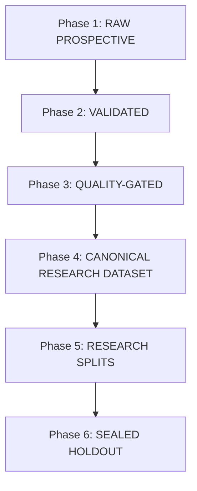

# V9 전향적 마이크로스트럭처 데이터셋 표준화 및 승격 프로토콜 (Dataset Canonicalization Protocol)

> [!IMPORTANT]
> **연구 데이터 무결성 절대 원칙:**
> 72시간 AWS 인프라 스트레스/Soak 테스트에서 수집된 시장 데이터는 **"인프라 무결성 검증 데이터"**이며, 자동으로 연구용 알파/백테스트 데이터셋으로 승격되지 않는다. 모든 데이터셋은 아래의 6단계 라이프사이클을 통과해야만 정규화된 연구 데이터셋으로 인정된다.

---

## 1. 데이터셋 라이프사이클 6단계

### Phase 1: RAW PROSPECTIVE (원시 전향적 수집)
- **정의:** 거래소 WebSocket에서 실시간으로 수신하여 로컬 디스크 및 S3 임시 경로(`market-data/temporary/<epoch>`)에 불변 기록된 원시 JSONL 데이터.
- **요건:**
  - 불변 기록(Append-only, WORM).
  - 로컬 수신 단조 시계(`monotonic_timestamp`) 및 벽시계(`receive_timestamp`) 병기.
  - 거래소 원문 페이로드 무손실 보존.

### Phase 2: VALIDATED (기초 무결성 검증)
- **정의:** `scan_closed_hour_microstructure.py` 풀스캔을 통해 구문 및 스키마 유효성이 100% 입증된 상태.
- **필수 게이트:**
  - `invalid_json = 0`
  - `schema_mismatch = 0`
  - `missing_required_fields = 0`
  - `non_finite_numeric = 0` (NaN, Inf 절대 불가)
  - `malformed_timestamps = 0`
  - `unknown_market = 0`
  - `scan_failures = 0`

### Phase 3: QUALITY-GATED (데이터 품질 및 연속성 심사)
- **정의:** `scripts/audit_72h_soak.py`를 통해 피드 커버리지 및 타임스탬프 품질 검사가 완료된 상태.
- **필수 게이트:**
  - 전체 UTC 시간대 피드 결측 여부 확인 (Feed Coverage Matrix).
  - 단조 시계 역전(`monotonic_reversals = 0`).
  - 비정상적인 침묵 구간(`large silence windows`) 및 레이턴시 분포 심사.
  - 통신 단절 및 재연결 이력 복원 완료.

### Phase 4: CANONICAL RESEARCH DATASET (표준 연구 데이터셋 승격)
- **정의:** S3 영구 보관소(`market-data/canonical/<dataset-id>`)에 아카이브되고 불변 해시(SHA-256)가 원장에 등록된 데이터셋.
- **요건:**
  - Zstandard Level 1 또는 상위 압축 포맷.
  - 데이터셋 메타데이터 및 매니페스트 번들링.
  - 모든 연구원이 동일한 불변 해시를 참조.

### Phase 5: RESEARCH SPLITS (탐색/교차검증 분할)
- **정의:** 시계열 순서를 보존하며 Lookahead 편향을 방지하는 정적 분할.
- **분할 원칙:**
  - 시계열 순서 절대 준수 (Purged Group Time-Series Split).
  - Train / Validation 세트 간 Purge 및 Embargo 윈도우(최소 2시간) 의무화.

### Phase 6: SEALED HOLDOUT (봉인된 전향적 홀드아웃)
- **정의:** 모델 학습, 하이퍼파라미터 튜닝, 특성 선별 과정에서 일체 열람되지 않는 암호학적 봉인 데이터셋.
- **개봉 규칙:**
  - 전략 코드 및 특성 산출 로직이 완전히 동결(Git SHA 고정)된 후 1회에 한해 최종 평가 수행.
  - 사후 파라미터 재튜닝 엄격히 금지.

---

## 2. 결측 및 이상치 처리 정책

- **누락된 데이터의 임의 대체(Imputation) 금지:** 결측 구간을 이전 호가(Forward fill)나 보간법으로 메워 완벽한 데이터인 것처럼 위장하지 않는다.
- **명시적 결측 마킹:** 거래소 단절 구간은 `DISCONNECTED` 또는 `TELEMETRY_INSUFFICIENT`로 기록한다.
