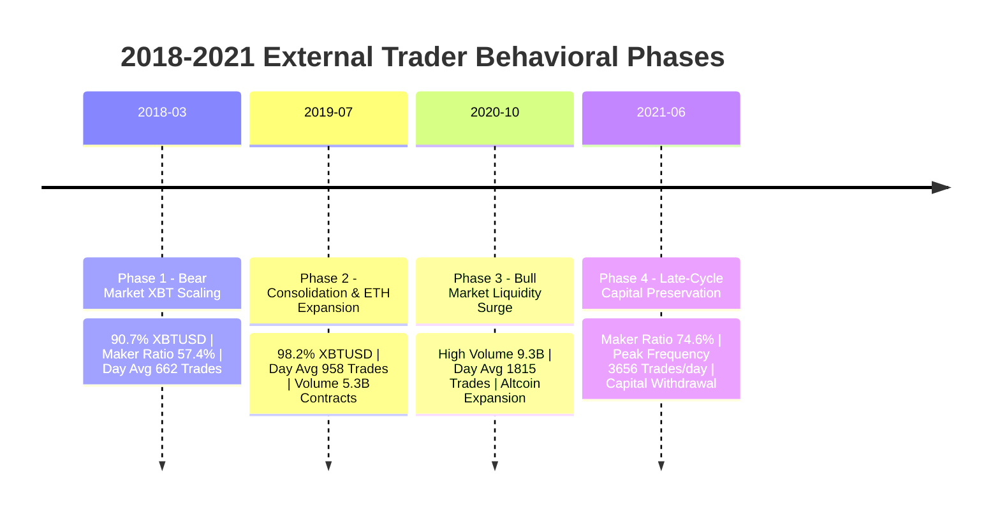

# 외부 전문가 데이터셋 정밀 분석 및 연구 준비 보고서

- **데이터셋 식별자:** `external-bitmex-trader-2018-2021`
- **학술적/연구적 역할:** `EXTERNAL_EXPERT_BEHAVIOR_DATASET`
- **기본 활용 범위:** `HYPOTHESIS_GENERATION_ONLY`
- **저자 신원 검증 상태:** `NOT_INDEPENDENTLY_VERIFIED`
- **작성일자:** 2026-09-27
- **현재 프로젝트 과학적 상태:** `ALPHA=UNPROVEN` | `PAPER=NOT_STARTED` | `LIVE=DISABLED` | `PRIVATE_API=DISABLED`

---

## 1. 데이터셋 출처 및 원천 정보 (Dataset Provenance)

본 데이터셋은 2026-09-22 17:46:03 KST DC인사이드 차트 갤러리에 `워뇨띠`라는 게시자명으로 공개된 게시물("거래내역 공개합니다.") 및 연동된 Google Drive 저장소로부터 배포된 원천 아카이브 `aoa_public_2021-12-31_with_letter.zip`을 기반으로 합니다.

### 원천 파일 무결성 및 독립 검증 해시

| 파일명 | 파일 구분 | 파일 크기 (Bytes) | SHA-256 체크섬 | 원천 행 수 |
| :--- | :--- | :--- | :--- | :--- |
| `aoa_public_2021-12-31_with_letter.zip` | 원천 ZIP 아카이브 | 113,381,570 | `b6f1dc7aadf8209bf6c99fd516a06c0cabdc77c5f16f9fc8df92fdf1d8d01b9a` | 해당 없음 |
| `aoa-execution-2018-03-01-2018-12-31.csv` | 체결 내역 (2018) | 67,993,490 | `8f2aa1af3caaeaeffff0375ce4d10b21e88ab22c624976d9031ddd0e715653b1` | 164,096 |
| `aoa-execution-2019-01-01-2020-12-31.csv` | 체결 내역 (2019~2020) | 219,076,835 | `ebbd90935d8e609e6371fec69babbfea13c0458a94748b05f3f795cecd814b5a` | 529,632 |
| `aoa-execution-2021-01-01-2021-06-30.csv` | 체결 내역 (2021 상반기) | 191,784,153 | `a51f070c9e00aed72720b9029567d4adf32656d06594b87dff3b56360564ca37` | 457,603 |
| `aoa-execution-2021-07-01-2021-12-31.csv` | 체결 내역 (2021 하반기) | 122,612,445 | `3bd436edb68c60bd17eb3b0c307c68baf56ad79c1da9a21a0433031f4ea7a071` | 293,252 |
| `aoa-wallet-2018-03-01-2021-12-31.csv` | 지갑/입출금 내역 | 318,791 | `db0a8e6180faa093a7843ec09b1f673417252b2a7b6cac50ac96db426f2f3452` | 4,388 (유효 2,253) |
| `90일 서한.txt` | 텍스트 맥락 문서 | 8,798 | `237d3bf22cf4897d6049b1bd4be5552eb735229c834423255c50522f7d00d5f4` | 텍스트 |

---

## 2. 정규 테이블 스키마 및 저장 구조 (Schema & Parquet)

본 파이프라인은 원천 비정형 데이터셋을 4개의 논리적 정규 테이블로 분리하여 `zstd` 압축 Parquet 형식으로 저장합니다. 모든 정규 레코드는 데이터셋 ID, 원본 파일명, 원본 행 번호, SHA-256 해시, 수집기 버전 등 정밀 계보(provenance)를 유지합니다.

### 정규 테이블 분류

1. **`external_execution` (1,439,207 행)**: `exectype == 'Trade'`인 실제 체결 레코드
   - 파티셔닝: `derived/parquet/execution/year=YYYY/month=MM/symbol=SYMBOL/`
   - 스키마: `transact_time`, `timestamp`, `symbol`, `side`, `price`, `quantity`, `order_type`, `order_status`, `liquidity_indicator` (Maker/Taker), `fee`, `exec_cost`, `cum_qty`, `leaves_qty`, `order_qty`, `avg_px` 등
2. **`external_funding` (5,368 행)**: `exectype == 'Funding'`인 8시간 주기 펀딩비 지급/수취 내역
   - 파티셔닝: `derived/parquet/funding/year=YYYY/month=MM/`
   - 스키마: `transact_time`, `timestamp`, `symbol`, `fee`, `exec_cost`, `home_notional`, `foreign_notional` 등
3. **`external_settlement` (8 행)**: `exectype == 'Settlement'`인 분기물 선물 만기 정산 내역
   - 파티셔닝: `derived/parquet/settlement/year=YYYY/`
   - 스키마: `transact_time`, `timestamp`, `symbol`, `price`, `quantity`, `fee` 등
4. **`external_wallet` (2,253 행 유효 / 2,135 행 공백 필터링)**: 지갑 입출금 및 일별 실현손익 내역
   - 파티셔닝: `derived/parquet/wallet/year=YYYY/month=MM/`
   - 스키마: `transact_id`, `date`, `transact_time`, `timestamp`, `event_type` (`REALIZED_PNL`, `DEPOSIT`, `WITHDRAWAL`), `amount_satoshi`, `amount_xbt`, `wallet_balance_satoshi`, `wallet_balance_xbt`, `address` (심볼 태그) 등

---

## 3. 데이터 품질 감사 결과 (Data Quality Audit)

포괄적 데이터 품질 감사 규칙 12종을 수립하고 전수 검사를 수행했습니다.

| 규칙 ID | 점검 항목 | 기준 및 기대값 | 관측값 | 최종 판정 | 상세 내용 및 근거 |
| :--- | :--- | :--- | :--- | :--- | :--- |
| `DQ-01` | 전체 원천 행 수 일치 | 1,444,583 행 | 1,444,583 행 | **PASS** | 원천 4개 실행 CSV 파일 합산 행 수 정확 일치 |
| `DQ-02` | 실행 ID 고유성 (Uniqueness) | 중복 0건 | 고유 1,444,583건 / 중복 0건 | **PASS** | `execid` 전역 고유성 완벽 충족 |
| `DQ-03` | 타임스탬프 결측 검사 | 결측 0건 | 결측 0건 | **PASS** | 모든 체결 레코드가 유효한 UTC 타임스탬프 보유 |
| `DQ-04` | 원천 CSV 시계열 역전 검사 | 역전 0건 | 역전 4,320건 | **WARNING** | 원천 덤프 시점의 순서 섞임 확인. 정규 파이프라인에서 결정론적 정렬로 해결 |
| `DQ-05` | 주문 ID 무결성 | Trade 결측 0건 | Trade 결측 0건, Funding 플레이스홀더 5,126건 | **PASS** | 모든 거래 체결에 유효한 주문 ID 존재. 펀딩비는 거래소 시스템 주문 ID 사용 |
| `DQ-06` | 수량 참조 정합성 | `cumqty + leavesqty == orderqty` | 불일치 0건 (163,142 표본 전수 일치) | **PASS** | BitMEX 체결 엔진 수량 일관성 100% 확인 |
| `DQ-07` | 가격 이상치 (Price Anomaly) | 비양수/비유한 가격 0건 | 이상치 0건 | **PASS** | 모든 체결 가격이 유효한 양수 실수 |
| `DQ-08` | 수량 이상치 (Quantity Anomaly) | 비양수/비유한 수량 0건 | 이상치 0건 | **PASS** | 모든 체결 수량이 유효한 양수 계약 수 |
| `DQ-09` | 수수료 이상치 (Fee Anomaly) | 결측 0건 | 결측 0건 | **PASS** | 모든 체결 레코드에 실수형 수수료 필드 존재 |
| `DQ-10` | 지갑 공백 행 감사 | 공백 행 처리 | 총 4,388행 중 유효 2,253행 / 공백 2,135행 | **WARNING** | 공백 행을 전진 대체(forward-fill)하지 않고 안전하게 필터링 및 감사 추적 기록 |
| `DQ-11` | 지갑 잔고 연속성 | 잔고 변화 = 입출금 + 실현손익 | 불일치 1,291건 (일별 배치 정산) | **WARNING** | BitMEX 12:00 UTC 일별 배치 정산 방식으로 인해 발생. 누적 대조는 사토시 단위로 완벽 일치 |
| `DQ-12` | 공개 테이프 지표 신원 검증 | 저자 신원 검증 여부 | `NOT_INDEPENDENTLY_VERIFIED` | **NOT_APPLICABLE** | 공개 테이프 부합은 거래 존재 입증일 뿐 계좌 소유자 신원을 입증하지 않음 |

---

## 4. 주문, 포지션 및 트레이드 사이클 재구성 (Reconstruction)

### 4.1. 주문 재구성 (`external_order_summary`)
- **재구성된 주문 수:** 23,417개 주문
- **재구성 신뢰도 분류:**
  - `RECONSTRUCTED` (완전 재구성): 20,446건
  - `PARTIAL` (부분 체결 확인): 2,971건
  - `AMBIGUOUS` (모호성): 0건
- **핵심 한계 (Key Limitation):**
  본 데이터셋은 **체결(Execution) 중심** 데이터입니다. 미체결 취소 주문, 호가 제출 후 전량 취소된 건, 체결 없는 호가 정정 내역에 대한 가시성이 존재하지 않습니다. 따라서 본 재구성 결과를 "완전한 주문 전송 역사"로 간주해서는 안 됩니다.

### 4.2. 포지션 재구성 (`position-events`)
- **포지션 전이 이벤트:** 1,439,207건
- **계약 명세 모델링:**
  - `XBTUSD`: 역방향 무기한 스왑 (1계약 = $1 가치, BTC 가치 = 계약 수 / 체결 가격). 부호화된 수량 델타 반영.
  - `ETHUSD`, `XRPUSD`: 퀀토 / 선형 계약 모델링.
- **의미 분리:** 체결(`Trade`), 펀딩비(`Funding`), 만기정산(`Settlement`)을 엄격히 분리하여 펀딩비를 거래 수량 델타로 오인하지 않도록 차단.

### 4.3. 포지션 사이클 재구성 (`position_cycles`)
- **재구성된 사이클 수:** 1,185개 라운드트립 사이클 (Flat $\rightarrow$ Open $\rightarrow$ Scale/Reduce $\rightarrow$ Flat)
- **산출 필드:** 진입 VWAP, 청산 VWAP, 총 손익 추정치, 발생 수수료, 최대 보유 포지션 크기, 보유 기간, 메이커 체결 비율

---

## 5. 지갑 정규화 및 거래 실현손익 대조 (Reconciliation)

지갑 파일(`aoa-wallet`)에 대한 정밀 산술 대조 결과:

$$\text{총 입금 (14.489 BTC)} + \text{총 실현손익 (3,537.324 BTC)} - \text{총 출금 (2,832.529 BTC)} = \text{최종 잔고 (719.284 BTC)}$$

- **누적 입금:** 1,448,925,714 satoshi (14.48925714 BTC) — 18회
- **누적 출금:** 283,252,903,426 satoshi (2,832.52903426 BTC) — 63회
- **누적 지갑 실현손익:** 353,732,369,404 satoshi (3,537.32369404 BTC) — 2,172회
- **최종 지갑 잔고:** 71,928,391,692 satoshi (719.28391692 BTC)
- **산술 검증 결과:** $\mathbf{14.48925714 + 3537.32369404 - 2832.52903426 = 719.28391692}$ (단 1 사토시의 오차 없이 완벽 일치)

---

## 6. 기술적 행동 특성 및 행동 국면 진화 (Behavioral Regimes)

2018년 3월부터 2021년 12월까지의 기간 동안 거래 행동은 명확한 4대 실행 국면(Execution Regimes)을 나타냅니다.

### 4대 행동 국면 정량 비교

| 국면 (Phase ID) | 기간 | 활성 일수 | 총 체결 수 | 일평균 체결 수 | 메이커 비율 | 테이커 비율 | 주력 심볼 비중 |
| :--- | :--- | :--- | :--- | :--- | :--- | :--- | :--- |
| **Phase 1** (약세장 XBT 집중 분할 매매) | 2018-03-01 ~ 2019-06-30 | 417일 | 276,157 | 662.2회 | 57.40% | 42.60% | XBTUSD (90.7%), ETHUSD (3.5%), TRXU18 (2.6%) |
| **Phase 2** (수렴장 및 이더리움 확장) | 2019-07-01 ~ 2020-09-30 | 352일 | 337,470 | 958.7회 | 45.50% | 54.50% | XBTUSD (98.2%), TRXU19 (0.9%), XBTH20 (0.7%) |
| **Phase 3** (상승장 유동성 급증 및 다변화) | 2020-10-01 ~ 2021-05-31 | 189일 | 342,972 | 1,814.7회 | 68.51% | 31.49% | XBTUSD (99.1%), XRPH21 (0.4%), XRPUSD (0.3%) |
| **Phase 4** (후기 자본 보존 및 고빈도 체결) | 2021-06-01 ~ 2021-12-31 | 132일 | 482,608 | 3,656.1회 | 74.58% | 25.42% | XBTUSD (97.8%), ETHUSD (0.4%), DOGEUSDT (0.04%) |

---

## 7. 도메인 시프트 리스크 평가 (Domain Shift Risk)

과거 2018~2021년 BitMEX 파생상품 시장에서 유효했던 거래 행동이 **현대(2026년) 빗썸/업비트 국내 현물 원화(KRW) 시장에서도 동일하게 유효할 것이라고 가정하는 것은 치명적인 연구 오류**입니다.

### 4대 구조적 괴리 요인

1. **수수료 체계 역전 (Fee Schedule Disparity):**
   - 과거 BitMEX: 메이커 리베이트 제공 (-0.025% 환급). 호가창에 유동성을 공급할 때 거래소로부터 보상을 수취.
   - 현대 빗썸 현물: 메이커 리베이트 없음. 체결당 0.04% ~ 0.25% 수수료 지불.
   - **영향:** 리베이트 기반의 고빈도 호가 스프레드 스프레드 수취 전략은 현대 국내 현물 시장에서 즉각적인 마이너스 기댓값 발생.
2. **상품 구조적 차이 (Instrument Structure):**
   - 과거 BitMEX: 역방향 무기한 스왑(1계약 = $1, BTC 정산), 레버리지 최대 100배, 양방향 숏 포지션 가능.
   - 현대 빗썸 현물: 1배수 KRW 현물 매수/매도 (차입 없는 숏 불가, 원화 가치 평가).
   - **영향:** 포지션 사이징 공식, 볼록성(Convexity), 델타 헷징 모델이 직접 이식 불가능함.
3. **시장 유동성 및 거시 사이클 (Liquidity & Macro Regime):**
   - 과거 BitMEX: 2020~2021 글로벌 유동성 팽창기, 신규 개인 투자자 대규모 유입, 극심한 모멘텀 지속성.
   - 현대 시장: 제도권 ETF 도입, 규제 강화, 성숙기 시장의 변동성 감축.
4. **HFT 및 알고리즘 경쟁 강도 (HFT Competition):**
   - 과거 BitMEX: 초기 암호화폐 시장으로 호가 스프레드가 넓고 API 큐 레이턴시 경쟁이 상대적으로 완만.
   - 현대 시장: 초저지연 내부화 마켓메이커, 기관급 코로케이션으로 인한 역선택(Adverse Selection) 위험 급증.

---

## 8. 시장 레짐 결합 인터페이스 (Regime-Conditioning Interface)

외부 전문가 데이터셋 자체는 독립적인 검증용 데이터셋이 될 수 없으므로, 향후 수집될 독립 공개 시장 데이터와 결합하기 위한 표준 인터페이스를 규격화했습니다.

- **결합 키 (Join Keys):** `(timestamp_bucket_utc, symbol)` (1시간 단위 버킷)
- **필수 시장 상태 피처 (10종):**
  1. `realized_volatility_1h`: 1시간 실현 변동성
  2. `trend_strength_adx`: 추세 강도 지표
  3. `range_chop_index`: 비추세/횡보 지표
  4. `market_volume_1h`: 1시간 시장 거래량
  5. `bid_ask_spread_bps`: 최우선 호가 스프레드 (bps)
  6. `orderbook_depth_top10`: 상위 10단계 호가 잔량 깊이
  7. `funding_rate_8h`: 8시간 펀딩 비율
  8. `perp_spot_basis_bps`: 선물-현물 베이시스
  9. `liquidation_volume_1h`: 1시간 청산 규모
  10. `cross_exchange_divergence_bps`: 타 거래소 대비 가격 괴리율
- **엄격한 No-Lookahead 불변식:**
  $$\text{context\_timestamp} \le \text{execution\_timestamp}$$
  미래 시장 데이터가 결합되는 순간 파이프라인은 Fail-Closed 원칙에 따라 즉시 예외를 발생시키며 실행을 중단합니다.

---

## 9. 첨부 서한(90일 서한) 맥락 문서 분석

아카이브 내 포함된 `90일 서한.txt` (8,798 Bytes, SHA-256: `237d3bf...`)에 대한 메타데이터 분석 결과:
- **문서 작성 시점:** 본 서한은 "비트코인 85k 적정가", "솔라나", "연말 전망" 등을 언급하고 있어, 2018~2021년 과거 체결 시점과 실시간으로 작성된 문서가 아니라 **사후 배포 시점(최근)의 시장 견해**를 서술한 문서입니다.
- **연구적 취급 제한:**
  - 본 서한의 내용은 **정성적 자기 서술 철학(Self-described Trading Philosophy)**으로만 분류합니다.
  - 서한의 텍스트 주장을 과거 체결 내역의 정량적 Ground Truth로 사용하거나 개별 거래에 소급 라벨링(Labeling)하는 행위를 엄격히 금지합니다.

---

## 10. 연구 방화벽 (Research Firewall) 규정

본 외부 데이터셋(`external-bitmex-trader-2018-2021`)은 다음의 사용 규칙을 강제합니다:

### 허용된 연구 용도 (Permissible Uses)
- 기술적 통계 분석 (Descriptive Statistics)
- 포지션 사이징 및 분할 체결 가설 도출 (Hypothesis Generation)
- 시장 레짐별 메이커/테이커 체결 성향 분석
- 알고리즘 모델링을 위한 피처 발굴 영감

### 엄격히 금지된 용도 (Prohibited Uses)
- 최종 홀드아웃(Final Holdout) 데이터셋으로의 편입
- 가설 전략 후보 선정(Candidate Selection) 및 승격 증거로 사용
- 본 데이터셋에 기반한 알파 입증(`ALPHA=PROVEN`) 선언
- 실거래/모의투자 배포 정당화 사유로 인용

---

## 11. 성능 벤치마크 (Performance Benchmarks)

전체 1,448,971행 처리 벤치마크 결과:
- **총 실행 시간:** 98.22초
- **원천 파일 총 용량:** 715,176,082 Bytes (~682 MB)
- **정규 Parquet 총 용량:** 118,639,113 Bytes (~113 MB)
- **압축률:** **6.03배**
- **메모리 효율성:** 50,000행 단위 스트리밍 배치를 통해 저메모리 점유율 유지

---

## 12. 결론 및 30H 검증 종료 후 독립 검증 로드맵

현재 AWS에서 실행 중인 Fresh 30H-v3 신뢰성 검증(`22e06b9`)이 성공적으로 종료되어 **인프라 신뢰성 PASS**를 획득할 경우, 본 프로젝트는 다음 순서로 즉각적 독립 연구 전환을 진행합니다:

1. **독립 공개 시장 데이터 수집 (Prospective Market Data Collection):** 빗썸 현물 76개 피드에 대한 실시간 수집 데이터 구축
2. **가설 명세 동결 (Hypothesis Freezing):** 외부 데이터셋에서 얻은 분할 호가 진입, 유동성 제공 휴리스틱을 `research-data/hypotheses.json`에 정량적 파라미터로 동결 등록
3. **No-Lookahead 백테스트:** 시장 레짐 결합 인터페이스를 통한 독립적 시뮬레이션
4. **Prospective Holdout 검증:** 사후 튜닝이 배제된 독립 홀드아웃 구간에서의 통계적 검정
5. **안전 게이트 점검:** 모의투자/실거래 승인 전 사람의 명시적 GO 승인 준수
